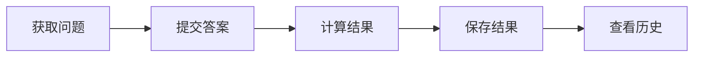

# Deno学习记录 📘

<div align="left">


<br>

<br>

<br>


</div>

## 📋 目录

### 一、Deno基础技术

- [项目概述](#项目概述)
- [技术栈](#技术栈)
- [Deno基础用法](#deno基础用法)
- [权限管理](#权限管理)
- [常用命令](#常用命令)
- [环境变量](#环境变量)
- [第三方库和依赖管理](#第三方库和依赖管理)
- [Deno部署指南](#deno部署指南)

### 二、项目具体实现

- [项目结构](#项目结构)
- [API路由](#api路由)
- [数据模型](#数据模型)
- [MongoDB数据库操作](#mongodb数据库操作)
- [MBTI测试实现细节](#mbti测试实现细节)

### 三、最佳实践和扩展

- [注意事项和最佳实践](#注意事项和最佳实践)
- [前端展示与UI优化](#前端展示与ui优化)
- [常见问题排查](#常见问题排查)
- [代码规范](#代码规范)
- [扩展和改进](#扩展和改进)
- [资源链接](#资源链接)

---

## 🚀 项目概述

这是一个基于Deno运行时的后端服务项目，主要功能包括MBTI人格测试系统。项目采用TypeScript语言开发，使用Oak HTTP服务器框架处理HTTP请求，MongoDB作为数据存储解决方案。

---

## 💻 技术栈

| 分类 | 技术 | 描述 |
|------|------|------|
| **运行时环境** | Deno | 安全的JavaScript和TypeScript运行时 |
| **语言** | TypeScript | 带有类型系统的JavaScript超集 |
| **HTTP服务器框架** | Oak | 受Koa启发的Deno中间件框架 |
| **数据库** | MongoDB | NoSQL文档数据库 |
| **ODM** | Mongoose | MongoDB对象模型工具 |
| **API文档** | 暂无 | 可考虑添加Swagger |
| **测试框架** | Deno内置测试工具 | Deno自带的测试功能 |

---

## 🛠️ 环境准备

在开始项目之前，请准备以下环境：

### 1. 安装Deno

Deno 是一个现代的JavaScript和TypeScript运行时环境。推荐使用以下命令安装：

| 操作系统 | 命令 |
| --- | --- |
| macOS / Linux | \`curl -fsSL <https://deno.land/install.sh> |
| Windows | \`irm <https://deno.land/install.ps1> |

验证安装：

```bash
deno --version
```

> **注**：更多安装选项（如Homebrew）请参考 Deno安装指南。

### 2. 安装MongoDB

项目使用 MongoDB 作为数据库。您可以选择本地安装或使用Docker。

#### 2.1 本地安装MongoDB

请访问 MongoDB安装指南 安装。启动服务：

```bash
mongod
```

#### 2.2 使用Docker运行MongoDB

运行以下命令：

```bash
docker run -d -p 27017:27017 --name mongodb mongo:latest
```

## 🦕 Deno基础用法

## ⚡ 常用命令

项目中定义了多个Deno任务，可以通过`deno task <task_name>`执行：

| 命令 | 描述 |
|------|------|
| `deno task dev` | 开发模式启动 |
| `deno task start` | 生产模式启动 |
| `deno task hot-reload` | 热重载模式 |
| `deno task test` | 运行测试 |
| `deno task mongo:init` | 初始化MongoDB |
| `deno task mongo:generate-mbti` | 生成MBTI测试数据 |
| `deno run task -- watch` | 监听文件变化 |

### 文件操作

#### 读取文件

Deno提供了简单直观的文件API：

```typescript
// 同步读取文件
const text = Deno.readTextFileSync("./data/config.json");
const data = JSON.parse(text);

// 异步读取文件
try {
  const text = await Deno.readTextFile("./data/users.json");
  const users = JSON.parse(text);
  console.log(users);
} catch (error) {
  console.error("读取文件失败:", error);
}

// 读取二进制文件
const data = await Deno.readFile("./assets/image.png");
```

#### 写入文件

```typescript
// 同步写入文本文件
const data = { name: "Test User", email: "test@example.com" };
Deno.writeTextFileSync("./data/user.json", JSON.stringify(data, null, 2));

// 异步写入文件
await Deno.writeTextFile("./logs/app.log", `[${new Date().toISOString()}] Server started\n`, { append: true });

// 写入二进制文件
await Deno.writeFile("./output/data.bin", new Uint8Array([0, 1, 2, 3, 4]));
```

#### 文件操作工具函数

```typescript
// 判断文件是否存在
async function fileExists(path: string): Promise<boolean> {
  try {
    await Deno.stat(path);
    return true;
  } catch (error) {
    if (error instanceof Deno.errors.NotFound) {
      return false;
    }
    throw error;
  }
}

// 创建目录（如果不存在）
async function ensureDir(dir: string): Promise<void> {
  try {
    const fileInfo = await Deno.stat(dir);
    if (!fileInfo.isDirectory) {
      throw new Error(`路径存在但不是目录: ${dir}`);
    }
  } catch (error) {
    if (error instanceof Deno.errors.NotFound) {
      await Deno.mkdir(dir, { recursive: true });
      return;
    }
    throw error;
  }
}
```

### 处理静态资源

在Oak HTTP服务器框架中使用静态文件中间件：

```typescript
import { Application, Router } from "oak";
import { send } from "https://deno.land/x/oak@v12.6.1/send.ts";

const app = new Application();
const router = new Router();

// 静态文件处理中间件
app.use(async (ctx, next) => {
  try {
    // 处理静态文件请求
    if (ctx.request.url.pathname.startsWith("/static")) {
      const path = ctx.request.url.pathname.replace("/static", "");
      await send(ctx, path, {
        root: `${Deno.cwd()}/public`,
        index: "index.html",
      });
      return;
    }
    await next();
  } catch (err) {
    if (err.status !== 404) {
      throw err;
    }
    await next();
  }
});

// 自定义静态文件服务函数
async function serveStaticFile(ctx: Context, filePath: string): Promise<void> {
  try {
    const fullPath = `${Deno.cwd()}/public/${filePath}`;
    
    // 检查文件是否存在
    try {
      await Deno.stat(fullPath);
    } catch (error) {
      if (error instanceof Deno.errors.NotFound) {
        ctx.response.status = 404;
        ctx.response.body = { error: "File not found" };
        return;
      }
      throw error;
    }
    
    // 设置内容类型
    let contentType = "application/octet-stream";
    if (filePath.endsWith(".html")) contentType = "text/html";
    else if (filePath.endsWith(".css")) contentType = "text/css";
    else if (filePath.endsWith(".js")) contentType = "text/javascript";
    else if (filePath.endsWith(".json")) contentType = "application/json";
    else if (filePath.endsWith(".png")) contentType = "image/png";
    else if (filePath.endsWith(".jpg") || filePath.endsWith(".jpeg")) contentType = "image/jpeg";
    
    // 读取并发送文件
    const content = await Deno.readFile(fullPath);
    ctx.response.headers.set("Content-Type", contentType);
    ctx.response.body = content;
  } catch (error) {
    console.error(`提供静态文件失败: ${filePath}`, error);
    ctx.response.status = 500;
    ctx.response.body = { error: "Internal server error" };
  }
}

// 使用示例
router.get("/images/:filename", async (ctx) => {
  const filename = ctx.params.filename;
  await serveStaticFile(ctx, `images/${filename}`);
});
```

### 使用Web标准API

Deno使用Web标准API进行开发，无需额外的库：

```typescript
// 使用fetch API发起网络请求
async function fetchData(url: string) {
  try {
    const response = await fetch(url);
    if (!response.ok) {
      throw new Error(`HTTP错误: ${response.status}`);
    }
    return await response.json();
  } catch (error) {
    console.error("请求失败:", error);
    return null;
  }
}

// 使用URL API解析URL
const url = new URL("https://example.com/api/users?page=1&limit=10");
console.log(url.searchParams.get("page")); // "1"

// 使用EventTarget
const target = new EventTarget();
target.addEventListener("message", (event) => {
  console.log("收到消息:", event.detail);
});
target.dispatchEvent(new CustomEvent("message", { detail: "Hello Deno!" }));
```

### 使用Web Worker

Deno支持多线程处理：

```typescript
// main.ts
// 创建Web Worker
const worker = new Worker(new URL("./worker.ts", import.meta.url).href, { type: "module" });

// 发送消息到Worker
worker.postMessage({ type: "process", data: [1, 2, 3, 4, 5] });

// 处理Worker返回的消息
worker.onmessage = (e) => {
  console.log("Worker结果:", e.data);
  // 完成后终止Worker
  worker.terminate();
};

// worker.ts
// 接收并处理主线程消息
self.onmessage = async (e) => {
  const { type, data } = e.data;
  
  if (type === "process") {
    // 执行耗时操作
    const result = await processData(data);
    // 返回结果给主线程
    self.postMessage(result);
  }
};

async function processData(numbers: number[]): Promise<number> {
  // 模拟耗时计算
  await new Promise(resolve => setTimeout(resolve, 1000));
  return numbers.reduce((sum, num) => sum + num, 0);
}
```

### 执行Shell命令

Deno提供API执行子进程：

```typescript
// 简单命令执行
const process = Deno.run({
  cmd: ["ls", "-la"],
  stdout: "piped",
  stderr: "piped"
});

// 等待命令完成并获取输出
const { code } = await process.status();
if (code === 0) {
  const output = await process.output();
  console.log(new TextDecoder().decode(output));
} else {
  const errorOutput = await process.stderrOutput();
  console.error(new TextDecoder().decode(errorOutput));
}
process.close();

// 传递环境变量
const process = Deno.run({
  cmd: ["printenv", "MY_VARIABLE"],
  env: { "MY_VARIABLE": "Hello Deno!" },
  stdout: "piped"
});
```

### 使用WebSocket

Deno支持WebSocket进行实时通信：

```typescript
// 服务端WebSocket
import { Application } from "oak";
import { Server } from "https://deno.land/std@0.196.0/http/server.ts";
import { WebSocketServer } from "https://deno.land/x/websocket@v0.1.4/mod.ts";

// 创建WebSocket服务器
const wss = new WebSocketServer({ port: 8080 });

wss.on("connection", (ws) => {
  console.log("新客户端连接");
  
  // 处理消息
  ws.on("message", (message) => {
    console.log("收到消息:", message);
    // 广播消息给所有客户端
    wss.clients.forEach((client) => {
      if (client.readyState === WebSocket.OPEN) {
        client.send(`服务器时间: ${new Date().toISOString()}, 消息: ${message}`);
      }
    });
  });
  
  // 处理连接关闭
  ws.on("close", () => {
    console.log("客户端断开连接");
  });
});

// 客户端WebSocket
const socket = new WebSocket("ws://localhost:8080");

socket.onopen = () => {
  console.log("连接已建立");
  socket.send("Hello Server!");
};

socket.onmessage = (event) => {
  console.log("收到消息:", event.data);
};

socket.onclose = () => {
  console.log("连接已关闭");
};
```

---

## 🔐 环境变量

项目通过`.env`文件和`Deno.env.get()`方法管理环境变量：

```
MONGODB_URI=mongodb://[username]:[password]@[host]/
MONGODB_DATABASE=database_name
```

> ⚠️ **警告**: 切勿将包含敏感信息的.env文件提交到版本控制系统。

---

## 🛡️ 权限管理

Deno需要明确的权限才能访问系统资源：

| 权限标志 | 描述 |
|----------|------|
| `--allow-net` | 网络访问权限 |
| `--allow-env` | 环境变量访问权限 |
| `--allow-read` | 文件读取权限 |
| `--allow-write` | 文件写入权限 |
| `--allow-sys` | 系统信息访问权限 |

在`deno.json`中，这些权限已通过task配置进行预设。

---

## 📦 第三方库和依赖管理

### 常用第三方库

| 库名 | 来源 | 作用 | 用法示例 |
|------|------|------|---------|
| **Oak** | JSR | HTTP服务器框架 | `import { Application } from "oak";` |
| **Mongoose** | npm | MongoDB对象建模工具 | `import mongoose from "mongoose";` |
| **Zod** | npm | 类型验证库 | `import { z } from "zod";` |
| **std/assert** | JSR | 断言库 | `import { assertEquals } from "@std/assert";` |
| **cliffy** | deno.land | CLI框架和工具 | `import { Command } from "cliffy";` |
| **Fresh** | JSR | Web框架 | `import { defineConfig } from "fresh";` |
| **MD5** | npm | 哈希加密算法 | `import md5 from "md5";` |
| **AJV** | esm.sh | JSON Schema验证器 | `import Ajv from "ajv";` |
| **JWT** | deno.land | JSON Web Token处理 | `import { create, verify } from "djwt";` |

### 数据验证与安全相关库

#### 1. AJV 和 JSON Schema

[AJV](https://ajv.js.org/)是一个高性能的JSON Schema验证器，用于验证数据结构是否符合预定义的模式：

```typescript
import Ajv from "ajv";
import addFormats from "ajv-formats";

// 初始化AJV
const ajv = new Ajv({
  allErrors: true,      // 报告所有错误（而不是第一个）
  removeAdditional: true, // 删除schema中未定义的属性
  useDefaults: true     // 使用模式中定义的默认值
});

// 添加格式验证
addFormats(ajv);

// 定义JSON Schema
const userSchema = {
  type: "object",
  properties: {
    id: { type: "string" },
    name: { type: "string", minLength: 2 },
    email: { type: "string", format: "email" },
    age: { type: "number", minimum: 0 }
  },
  required: ["id", "name", "email"],
  additionalProperties: false
};

// 编译schema以便重复使用
const validateUser = ajv.compile(userSchema);

// 使用封装的验证工具
function validateData(data: unknown, schema: object): { isValid: boolean; errors: any[] } {
  const validate = ajv.compile(schema);
  const isValid = validate(data);
  return {
    isValid,
    errors: isValid ? [] : (validate.errors || [])
  };
}

// 示例使用
const result = validateData(userData, userSchema);
if (!result.isValid) {
  console.error("数据验证失败:", result.errors);
}
```

**最佳实践：**

- 集中管理所有JSON Schema定义
- 为复杂API创建可重用的验证函数
- 使用AJV的自定义关键字和格式拓展特定需求
- 在API端点处理前验证请求数据

#### 2. MD5

MD5是一种广泛使用的哈希算法，在项目中常用于密码加密或生成唯一标识符：

```typescript
import md5 from "md5";

// 基本使用
const hash = md5("some-string"); // 返回32字符的哈希字符串

// 用于密码加密（推荐添加盐值）
function hashPassword(password: string, salt: string): string {
  return md5(password + salt);
}

// 用于生成API请求签名
function generateSignature(params: Record<string, string>, secretKey: string): string {
  // 按字母顺序排序参数
  const sortedKeys = Object.keys(params).sort();
  let signStr = "";
  
  // 构建签名字符串
  for (const key of sortedKeys) {
    signStr += `${key}=${params[key]}&`;
  }
  
  // 添加密钥并生成最终签名
  signStr += secretKey;
  return md5(signStr);
}
```

**安全提示：**

- ⚠️ MD5不再被认为是安全的密码哈希算法
- 对于密码存储，推荐使用更安全的算法如bcrypt或Argon2
- MD5适用于非安全场景如缓存键生成、内容完整性校验等

#### 3. JWT (JSON Web Token)

JWT用于创建和验证令牌，常用于身份验证和授权：

```typescript
import { create, verify, decode } from "djwt";
import { crypto } from "std/crypto";

// 生成密钥
async function generateKey(): Promise<CryptoKey> {
  return await crypto.subtle.generateKey(
    { name: "HMAC", hash: "SHA-512" },
    true,
    ["sign", "verify"]
  );
}

// 创建JWT令牌
async function createToken(
  payload: Record<string, unknown>, 
  expiresIn: number = 60 * 60 // 1小时，以秒为单位
): Promise<string> {
  const key = await generateKey();
  
  const jwt = await create(
    { alg: "HS512", typ: "JWT" },
    { 
      ...payload, 
      exp: Math.floor(Date.now() / 1000) + expiresIn 
    },
    key
  );
  
  return jwt;
}

// 验证JWT令牌
async function verifyToken(token: string): Promise<Record<string, unknown> | null> {
  try {
    const key = await generateKey(); // 生产环境中应该重用密钥
    const payload = await verify(token, key);
    return payload;
  } catch (err) {
    console.error("JWT验证失败:", err);
    return null;
  }
}

// 使用示例
const userToken = await createToken({ userId: "123", role: "admin" });
// 在请求头中使用: Authorization: Bearer <token>

// 身份验证中间件
async function authMiddleware(ctx: Context, next: Next) {
  try {
    const authHeader = ctx.request.headers.get("Authorization");
    
    if (!authHeader || !authHeader.startsWith("Bearer ")) {
      throw new Error("缺少有效的授权令牌");
    }
    
    const token = authHeader.replace("Bearer ", "");
    const payload = await verifyToken(token);
    
    if (!payload) {
      throw new Error("无效的令牌");
    }
    
    // 将用户信息附加到上下文
    ctx.state.user = payload;
    await next();
  } catch (error) {
    ctx.response.status = 401;
    ctx.response.body = {
      success: false,
      code: 401,
      message: "未授权访问"
    };
  }
}
```

**JWT最佳实践：**

- 设置合理的过期时间，避免令牌永久有效
- 仅在令牌中存储必要信息，避免存储敏感数据
- 使用HTTPS传输令牌
- 实现令牌刷新机制
- 考虑使用Redis等存储机制来支持令牌吊销

### 实际应用示例

#### JSON Schema用于API验证

```typescript
// src/schemas/user.schema.ts
export const createUserSchema = {
  type: "object",
  properties: {
    username: { type: "string", minLength: 3, maxLength: 20 },
    email: { type: "string", format: "email" },
    password: { type: "string", minLength: 8 }
  },
  required: ["username", "email", "password"],
  additionalProperties: false
};

// src/middlewares/validate.middleware.ts
import { Context, Next } from "oak";
import { validateSchema } from "../utils/json-schema.ts";

export function validateRequest(schema: object) {
  return async (ctx: Context, next: Next) => {
    try {
      const body = await ctx.request.body().value;
      const { isValid, errors } = validateSchema(body, schema);
      
      if (!isValid) {
        ctx.response.status = 400;
        ctx.response.body = {
          success: false,
          code: 400,
          message: "请求数据验证失败",
          errors: errors
        };
        return;
      }
      
      await next();
    } catch (error) {
      ctx.response.status = 400;
      ctx.response.body = {
        success: false,
        code: 400,
        message: "无效的请求数据"
      };
    }
  };
}

// 路由中使用验证中间件
router.post("/api/users", validateRequest(createUserSchema), userController.createUser);
```

#### MD5用于生成唯一标识符

```typescript
// 生成测试ID
function generateTestId(userId: string, timestamp: number): string {
  return md5(`${userId}-${timestamp}-${Math.random()}`).substring(0, 16);
}

// MBTI测试提交
async function submitTest(testData: MBTITestSubmission) {
  const now = new Date();
  const testId = generateTestId(testData.user_id, now.getTime());
  
  // 存储测试数据...
}
```

### JSR (Deno包注册表)

JSR是官方的Deno包注册表，提供TypeScript和JavaScript包：

```typescript
// 从JSR导入包
import { Application, Router } from "jsr:@oak/oak@^12.6.1";
import { assertEquals } from "jsr:@std/assert@1";
```

#### 在项目中使用JSR

1. 在`deno.json`中配置imports：

```json
{
  "imports": {
    "@std/assert": "jsr:@std/assert@1",
    "oak": "jsr:@oak/oak@^12.6.1",
    "fresh": "jsr:@denoland/fresh@^2.0.0"
  }
}
```

2. 然后在代码中导入：

```typescript
import { Application } from "oak";
import { assertEquals } from "@std/assert";
```

### NPM支持

Deno支持直接使用NPM包，无需转换或额外工具：

```typescript
// 直接从npm导入
import mongoose from "npm:mongoose@^8.0.0";
import { z } from "npm:zod@^3.22.4";
```

#### 在项目中使用NPM包

1. 在`deno.json`中配置imports：

```json
{
  "imports": {
    "mongoose": "npm:mongoose@^8.0.0",
    "zod": "npm:zod@^3.22.4",
    "md5": "npm:md5@^2.3.0"
  }
}
```

2. 然后在代码中导入：

```typescript
import mongoose from "mongoose";
import { z } from "zod";
```

### 其他源导入

Deno还支持从URL直接导入：

```typescript
// 从URL导入
import { Command } from "https://deno.land/x/cliffy@v0.25.7/command/mod.ts";
import { MySQLConnector } from "https://deno.land/x/mysql@v2.12.1/mod.ts";
```

### 包版本管理

---

## 📁 项目结构

```
/
├── main.ts                # 主入口文件
├── src/
│   ├── routes/            # 路由定义
│   ├── controllers/       # 控制器
│   ├── services/          # 服务层
│   ├── middleware/        # 中间件
│   ├── utils/             # 工具函数
│   ├── scripts/           # 脚本文件
│   └── examples/          # 示例代码
├── deno.json              # Deno项目配置
└── .env                   # 环境变量
```

---

## 🔌 API路由

项目使用Oak HTTP服务器框架定义路由，主要API路由包括：

### MBTI测试API

```typescript
// MBTI测试相关路由
router.get("/api/mbti/questions", mbtiController.getQuestions);
router.get("/api/mbti/types", mbtiController.getAllTypes);
router.get("/api/mbti/types/:type", mbtiController.getTypeDetails);
router.get("/api/mbti/roles", mbtiController.getRoles);
router.post("/api/mbti/test", mbtiController.submitTest);
router.get("/api/mbti/user/:userId/history", authMiddleware, mbtiController.getUserTestHistory);
```

> 📝 **注意**：用户历史记录API需要身份验证。

---

## 📊 数据模型

### MBTI相关模型

<details>
<summary><b>MBTIQuestion</b>: MBTI测试问题</summary>

```typescript
interface MBTIQuestion {
  id: number;
  question: string;
  options: Array<{
    value: string;
    text: string;
  }>;
  dimension: string;
}
```
</details>

<details>
<summary><b>MBTIType</b>: MBTI人格类型</summary>

```typescript
interface MBTIType {
  type: string;       // 如 "INTJ-A"
  name: string;       // 如 "建筑师"
  title: string;      // 如 "建筑师 (自信型)"
  description: string;
  strengths: string[];
  weaknesses: string[];
  roles: string;
  careers: string[];
  famousPeople: string[];
}
```
</details>

<details>
<summary><b>MBTIRole</b>: MBTI角色分类</summary>

```typescript
interface MBTIRole {
  role: string;      // 如 "分析师"
  types: string[];   // 如 ["INTJ", "INTP", "ENTJ", "ENTP"]
  description: string;
  traits: string[];
  color: string;     // 如 "#88619A"
}
```
</details>

<details>
<summary><b>MBTITestResult</b>: 测试结果</summary>

```typescript
interface MBTITestResult {
  type: string;  // 如 "INTJ-A"
  scores: {
    EI_E: number, EI_I: number,
    SN_S: number, SN_N: number,
    TF_T: number, TF_F: number,
    JP_J: number, JP_P: number,
    AT_A: number, AT_T: number
  };
}
```
</details>

---

## 🧩 MBTI测试实现细节

### 1. 测试流程



1. 用户获取测试问题 (`GET /api/mbti/questions`)
2. 用户提交测试答案 (`POST /api/mbti/test`)
3. 系统计算测试结果并保存
4. 用户可查看测试历史 (`GET /api/mbti/user/:userId/history`)

### 2. 结果计算逻辑

<details>
<summary>展开查看结果计算代码</summary>

```typescript
private calculateTestResult(responses: MBTITestResponse[]): MBTITestResult {
  // 初始化分数
  const scores = {
    EI_E: 0, EI_I: 0,
    SN_S: 0, SN_N: 0,
    TF_T: 0, TF_F: 0,
    JP_J: 0, JP_P: 0,
    AT_A: 0, AT_T: 0
  };
  
  // 累计每个维度的分数
  for (const response of responses) {
    switch (response.selected_value) {
      case 'E': scores.EI_E++; break;
      case 'I': scores.EI_I++; break;
      // ...其他维度
    }
  }
  
  // 确定每个维度的主导特质
  const E_I = scores.EI_E > scores.EI_I ? 'E' : 'I';
  const S_N = scores.SN_S > scores.SN_N ? 'S' : 'N';
  const T_F = scores.TF_T > scores.TF_F ? 'T' : 'F';
  const J_P = scores.JP_J > scores.JP_P ? 'J' : 'P';
  const A_T = scores.AT_A > scores.AT_T ? 'A' : 'T';
  
  // 组合MBTI类型
  const mbtiType = `${E_I}${S_N}${T_F}${J_P}-${A_T}`;
  
  return {
    type: mbtiType,
    scores
  };
}
```
</details>

### 3. 数据库集合

MBTI测试系统使用了以下MongoDB集合：

| 集合名称 | 用途 |
|---------|------|
| `mbti_questions` | 存储测试问题 |
| `mbti_types` | 存储MBTI类型描述 |
| `mbti_roles` | 存储MBTI角色分类 |
| `mbti_test_results` | 存储用户测试记录 |

---

## 🗄️ MongoDB数据库操作

项目使用自定义的`MongoDBService`类进行数据库操作，主要方法如下：

### 连接数据库

```typescript
// 初始化连接
const mongoDBService = new MongoDBService({
  uri: "mongodb://[username]:[password]@[host]/",
  dbName: "database_name"
});

// 连接数据库
await mongoDBService.connect();

// 关闭连接
await mongoDBService.close();
```

### 基本CRUD操作

<details>
<summary>展开查看CRUD操作示例</summary>

```typescript
// 查询文档
const documents = await mongoDBService.find("collection_name", { field: "value" });

// 根据ID查询
const document = await mongoDBService.findById("collection_name", "id");

// 插入文档
const result = await mongoDBService.insertOne("collection_name", { field: "value" });

// 批量插入
const result = await mongoDBService.insertMany("collection_name", [{ field: "value" }]);

// 更新文档
const result = await mongoDBService.updateOne(
  "collection_name", 
  { field: "value" }, 
  { $set: { field: "new_value" } }
);

// 根据ID更新
const result = await mongoDBService.updateById("collection_name", "id", { field: "value" });

// 删除文档
const result = await mongoDBService.deleteOne("collection_name", { field: "value" });

// 根据ID删除
const result = await mongoDBService.deleteById("collection_name", "id");

// 聚合查询
const result = await mongoDBService.aggregate("collection_name", [
  { $match: { field: "value" } },
  { $group: { _id: "$field", count: { $sum: 1 } } }
]);
```
</details>

### MBTI实际数据库操作示例

<details>
<summary>查询所有MBTI类型</summary>

```typescript
async getAllTypes(): Promise<MBTIType[]> {
  try {
    await this.mongoDBService.connect();
    const types = await this.mongoDBService.find(this.typesCollection, {});
    return types as unknown as MBTIType[];
  } catch (error) {
    this.logger.error("获取所有MBTI类型失败:", error);
    throw error;
  } finally {
    await this.mongoDBService.close();
  }
}
```

</details>

<details>
<summary>保存测试结果</summary>

```typescript
// 新用户，创建记录
const newUserData = {
  user_id: testData.user_id,
  nickname: testData.nickname || testData.user_id,
  tests: [{
    test_id: testId,
    test_date: now,
    completed: isCompleted,
    responses: testData.responses,
    result: testResult
  }],
  test_count: 1,
  latest_type: testResult?.type || null,
  created_at: now,
  updated_at: now
};

await this.mongoDBService.insertOne(this.testResultsCollection, newUserData);
```
</details>

<details>
<summary>更新现有记录</summary>

```typescript
// 现有用户，更新记录
const userData = existingUsers[0] as Record<string, unknown>;
const tests = userData.tests as Array<Record<string, unknown>> || [];

tests.push({
  test_id: testId,
  test_date: now,
  completed: isCompleted,
  responses: testData.responses,
  result: testResult
});

const updateData: Record<string, unknown> = {
  tests,
  test_count: tests.length,
  updated_at: now
};

// 如果测试完成，更新最新类型
if (isCompleted && testResult) {
  updateData.latest_type = testResult.type;
}

await this.mongoDBService.updateOne(
  this.testResultsCollection,
  { user_id: testData.user_id },
  { $set: updateData }
);
```
</details>

### 分页查询

```typescript
const result = await mongoDBService.paginate(
  "collection_name",   // 集合名称
  1,                   // 页码
  10,                  // 每页记录数
  { field: "value" },  // 查询条件
  { sort: { field: 1 } } // 排序选项
);
```

#### 返回结果格式

| 字段 | 描述 |
|------|------|
| `data` | 数据数组 |
| `total` | 总记录数 |
| `page` | 当前页码 |
| `limit` | 每页记录数 |
| `pageCount` | 总页数 |

---

## 🧰 MongoDB查询语法

### 常用操作符

<details>
<summary>展开查看常用查询操作符</summary>

```typescript
// 相等查询
{ field: "value" }

// 不等查询
{ field: { $ne: "value" } }

// 大于/小于
{ field: { $gt: 10 } }  // 大于
{ field: { $lt: 10 } }  // 小于
{ field: { $gte: 10 } } // 大于等于
{ field: { $lte: 10 } } // 小于等于

// IN查询
{ field: { $in: ["value1", "value2"] } }

// 逻辑操作符
{ $and: [{ field1: "value1" }, { field2: "value2" }] }
{ $or: [{ field1: "value1" }, { field1: "value2" }] }

// 正则表达式
{ field: { $regex: "pattern", $options: "i" } } // i表示不区分大小写

// 存在性检查
{ field: { $exists: true } }
```
</details>

### 更新操作符

<details>
<summary>展开查看常用更新操作符</summary>

```typescript
// 设置字段值
{ $set: { field: "new_value" } }

// 增加数值
{ $inc: { counter: 1 } }

// 添加到数组
{ $push: { array_field: "new_item" } }

// 从数组移除
{ $pull: { array_field: "item_to_remove" } }

// 添加到集合（不重复）
{ $addToSet: { array_field: "new_unique_item" } }
```
</details>

---

## 📝 注意事项和最佳实践

### 数据库连接管理

- ✅ 始终在操作结束后关闭数据库连接（使用`finally`块）
- ✅ 使用try-catch-finally处理数据库操作可能出现的异常

### 错误处理和日志

- ✅ 使用统一的Logger类进行日志记录
- ✅ 所有外部调用（数据库、API）都应有错误处理

### MongoDB操作

- ✅ 使用`countDocuments`而不是已废弃的`count`方法
- ✅ 使用`find`方法时添加合适的投影(projection)以减少数据传输
- ✅ 对大结果集使用分页查询

### 安全性

- 🔒 敏感API使用`authMiddleware`进行保护
- 🔒 不要在代码中硬编码敏感信息（如数据库密码）

### 性能优化

- ⚡ 大量文档使用批量操作（insertMany, updateMany）
- ⚡ 添加适当的索引以加速查询
- ⚡ 使用投影限制返回字段

### 特定项目注意事项

- 📋 MBTI测试需要至少16个问题才能完成
- 📋 每个用户可以有多个测试记录
- 📋 API响应格式保持一致（包含success, code, data/message字段）

---

### API响应格式设计

为确保前端能高效处理API响应，所有API应遵循一致的响应格式：

```typescript
interface ApiResponse<T> {
  success: boolean;     // 请求是否成功
  code: number;         // 状态码，与HTTP状态码保持一致
  data?: T;             // 成功时返回的数据
  message?: string;     // 错误时的消息
  pagination?: {        // 分页信息（如适用）
    total: number;
    page: number;
    limit: number;
    pageCount: number;
  };
}
```

### 前端实现建议

1. **MBTI测试界面设计**:
   - 采用分步骤展示问题，减轻用户负担
   - 进度指示器显示完成情况
   - 使用直观的选项设计（如滑块、单选按钮）
   - 结果页面突出显示用户的MBTI类型和特点

2. **响应式设计**:
   - 确保在移动设备和桌面设备上都有良好的用户体验
   - 针对不同屏幕尺寸优化布局
   - 考虑触摸操作的便利性

3. **性能优化**:
   - 实施懒加载技术，特别是对MBTI类型详情页面
   - 缓存用户历史测试结果
   - 优化图片和资源加载

4. **交互体验优化**:
   - 添加适当的动画和过渡效果
   - 实现即时反馈机制
   - 考虑离线支持，允许用户在无网络情况下完成测试

### 用户体验优化建议

- 📱 **引导式测试流程**: 提供清晰的指引和说明
- 🎯 **个性化结果展示**: 根据用户的MBTI类型提供个性化的结果页面
- 🔄 **社交分享功能**: 允许用户分享他们的测试结果到社交媒体
- 🌓 **主题定制**: 提供浅色/深色模式切换

---

## ❓ 常见问题排查

### MongoDB连接问题

- 🔍 检查URI和数据库名称配置
- 🔍 确认MongoDB服务器运行状态
- 🔍 检查网络连接和防火墙设置

### API返回空数据

- 🔍 检查数据库连接
- 🔍 确认集合中有数据
- 🔍 验证查询条件是否正确

### 权限问题

- 🔍 确认用户有正确的数据库权限
- 🔍 验证授权令牌是否有效

### 部署相关问题

- 🔍 确保目标环境包含所有必要的环境变量
- 🔍 检查运行命令是否包含所有必要的权限标志

---

## 🚀 扩展和改进

1. **API文档**: 考虑添加Swagger或类似工具
2. **缓存层**: 为频繁访问的数据添加缓存
3. **监控**: 添加性能监控和健康检查
4. **CI/CD**: 设置自动化测试和部署

---

建议在`deno.json`中集中管理所有依赖的版本，便于后续升级和维护：

```json
{
  "imports": {
    "oak": "jsr:@oak/oak@^12.6.1",
    "mongoose": "npm:mongoose@^8.0.0",
    "std/": "https://deno.land/std@0.196.0/"
  }
}
```

---

## 🚢 Deno部署指南

### 使用Deno Deploy

[Deno Deploy](https://deno.com/deploy)是官方的serverless平台，可以轻松部署Deno应用。

#### 1. 使用deployctl工具

首先安装deployctl工具：

```bash
deno install --allow-read --allow-write --allow-env --allow-net --allow-run --no-check -r -f https://deno.land/x/deploy/deployctl.ts
```

#### 2. 部署项目

```bash
# 直接部署
deployctl deploy --project=your-project-name main.ts

# 指定环境变量
deployctl deploy --project=your-project-name --env-file=.env main.ts
```

#### 3. 通过deno.json配置

项目的`deno.json`可以包含部署配置：

```json
{
  "deploy": {
    "project": "your-project-id",
    "exclude": ["**/node_modules"],
    "include": [],
    "entrypoint": "main.ts"
  }
}
```

然后执行：

```bash
deno task deploy
```

### 部署前的准备

1. **确保项目结构正确**：
   - 入口文件应该是自包含的，或者能够访问所有依赖
   - 确保所有路径正确（相对路径和绝对路径）

2. **环境变量处理**：
   - 部署环境需要设置所有必需的环境变量
   - 可以在Deno Deploy控制台中配置环境变量
   - 敏感信息不应硬编码或包含在版本控制中

3. **文件系统限制**：
   - Deno Deploy不支持本地文件系统写入
   - 所有文件操作应替换为存储服务(如MongoDB)或内存存储

4. **网络访问和第三方服务**：
   - 确保所有外部服务都能从Deno Deploy访问
   - 使用适当的超时和重试策略处理间歇性连接问题

### 注意事项和限制

1. **冷启动**:
   - Serverless环境可能有冷启动延迟
   - 关键服务应优化以快速初始化

2. **执行时间限制**:
   - 请求处理时间有限制，长时间操作应拆分或异步处理

3. **内存限制**:
   - 遵循内存最佳实践，避免内存泄漏
   - 大型对象应分块处理或使用流处理

4. **依赖项**:
   - 确保所有依赖项都与Deno Deploy兼容
   - 某些依赖于Node.js API的npm包可能不兼容
   - 使用Deno标准库或专门的Deno包以获得最佳体验

5. **数据库连接**:
   - 使用连接池和合适的连接管理策略
   - 防止连接泄漏，确保在请求结束时关闭连接

6. **定时任务**:
   - Deno Deploy支持通过Cron触发器运行定时任务
   - 对于复杂的调度需求，可能需要外部服务

### 部署后的监控

- 使用Deno Deploy提供的日志和指标监控应用性能
- 考虑添加自定义日志记录以跟踪关键操作
- 实现健康检查端点以监控服务状态

```typescript
// 健康检查端点示例
router.get("/health", (ctx) => {
  ctx.response.status = 200;
  ctx.response.body = {
    status: "ok",
    timestamp: new Date().toISOString(),
    version: "1.0.0"
  };
});
```

---

## 📐 代码规范

- 📄 使用TSDoc风格的注释
- 🔄 保持一致的错误处理和日志记录模式
- 🧩 遵循模块化设计原则

---

## 📚 资源链接

- [Deno官方文档](https://deno.land/manual)
- [Oak HTTP服务器框架文档](https://deno.land/x/oak)
- [MongoDB文档](https://www.mongodb.com/docs/)
- [Mongoose文档](https://mongoosejs.com/docs/)
- [MBTI官方网站](https://www.myersbriggs.org/)
- [16Personalities](https://www.16personalities.com/)
