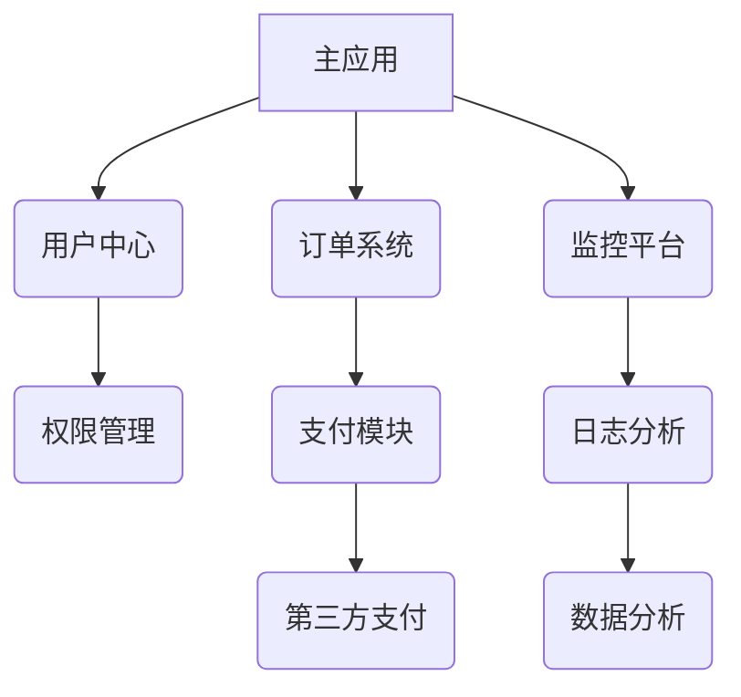

# Qiankun 微前端企业级实践指南

## 目录
1. [基础配置](#一基础配置)
2. [通信方案](#二通信方案)
3. [路由管理](#三路由管理)
4. [样式隔离](#四样式隔离)
5. [性能优化](#五性能优化)
6. [问题解决方案](#六问题解决方案)
7. [最佳实践](#七最佳实践)
8. [子应用间跳转与传值](#八子应用间跳转与传值)
9. [常见问题解决方案](#九常见问题解决方案)
10. [总结与展望](#十总结与展望)
11. [子应用优化策略](#十一子应用优化策略)

<a id="一基础配置"></a>
## 一、基础配置

### 1.1 主应用初始化
```javascript
// main-app.js
import { registerMicroApps, start } from 'qiankun';
const apps = [
{
name: 'sub-app',
entry: process.env.NODE_ENV === 'development'
? '//localhost:7100'
: '/sub-app/',
container: '#subContainer',
activeRule: '/sub',
props: {
basePath: '/main-app/sub',
mainToken: localStorage.getItem('token')
}
}
];
registerMicroApps(apps);
start({
sandbox: {
strictStyleIsolation: true,
experimentalStyleIsolation: true,
speedy: false
},
prefetch: 'all'
});
```

### 1.2 子应用接入规范
```javascript
// sub-app.js
let vueInstance = null;
export async function bootstrap() {
console.log('[SubApp] Bootstrap');
}
export async function mount(props) {
console.log('[SubApp] Mount', props);
vueInstance = createApp({
router: createRouter({
history: createWebHistory(props.basePath),
routes: [
{ path: '/page1', component: Page1 },
{ path: '/page2', component: Page2 }
]
})
}).mount(props.container.querySelector('#app'));
}
export async function unmount() {
console.log('[SubApp] Unmount');
vueInstance.$destroy();
}
```

<a id="二通信方案"></a>
## 二、通信方案

### 2.1 全局状态管理
```javascript
// 主应用状态初始化
const actions = initGlobalState({
user: JSON.parse(localStorage.getItem('user')),
token: {
value: localStorage.getItem('token'),
expire: Date.now() + 3600000
},
systemTime: Date.now()
});
// 子应用状态同步
export async function mount(props) {
// 初始化同步
localStorage.setItem('token', props.getGlobalState().token.value);
// 动态更新
props.onGlobalStateChange((state, prev) => {
if (state.token.expire !== prev.token.expire) {
localStorage.setItem('token_expire', state.token.expire);
}
}, true);
}
```
### 2.2 跨应用事件总线
```javascript
// event-bus.js
class CrossAppEvent {
constructor() {
this.events = new Map();
}
on(eventName, callback) {
const handlers = this.events.get(eventName) || [];
handlers.push(callback);
this.events.set(eventName, handlers);
}
emit(eventName, payload) {
const handlers = this.events.get(eventName) || [];
handlers.forEach(handler => handler(payload));
}
}
// 主应用初始化
const eventBus = new CrossAppEvent();
// 子应用A发送事件
eventBus.emit('ORDER_CREATED', { orderId: 12345 });
// 子应用B监听事件
eventBus.on('ORDER_CREATED', (payload) => {
console.log('收到订单创建事件:', payload);
refreshOrderList();
});
```

<a id="三路由管理"></a>
## 三、路由管理

### 3.1 路由配置规范
```javascript
// 子应用路由守卫
router.beforeEach((to, from, next) => {
if (window.__POWERED_BY_QIANKUN__) {
// 验证路由合法性
const validPaths = ['/page1', '/page2', '/detail'];
const isValid = validPaths.some(path => to.path.startsWith(path));
// 验证Token有效性
const isAuthenticated = checkToken(localStorage.getItem('token'));
if (!isValid || !isAuthenticated) {
next('/error');
return;
}
}
next();
});

// 主应用路由跳转封装
const microAppNavigate = (appName, path) => {
const appConfig = qiankunApps.find(app => app.name === appName);
if (appConfig) {
router.push(`${appConfig.activeRule}${path}`);
} else {
console.error(`未找到应用 ${appName} 的配置`);
}
};
// 使用示例
microAppNavigate('sub-app', '/page1');
```

<a id="四样式隔离"></a>
## 四、样式隔离

### 4.1 组件库解决方案
```vue
<!-- Element UI 组件 -->
<el-date-picker
:popper-append-to-body="false"
popper-class="micro-app-picker"
/>
<!-- Ant Design 组件 -->
<a-select
:getPopupContainer="trigger => trigger.parentElement"
popupClassName="micro-app-select"
/>
```

### 4.2 全局样式策略
```css
/* 微应用容器样式隔离 */
#sub-container {
all: initial; /* 重置继承样式 */
/* 限制样式作用域 */
* {
box-sizing: border-box;
font-family: inherit;
}
}
/* 弹出层样式重置 */
.micro-app-picker {
z-index: 1000 !important;
position: absolute !important;
.el-picker__popper {
transform: none !important;
}
}
```

<a id="五性能优化"></a>
## 五、性能优化

### 5.1 资源加载策略
```javascript
// 按需加载配置
start({
prefetch: (apps) => {
const hotApps = ['dashboard', 'monitor'];
return apps.filter(app => hotApps.includes(app.name));
},
sandbox: {
experimentalStyleIsolation: true
}
});
```

### 5.2 内存优化方案
```javascript
// 子应用卸载处理
export async function unmount() {
// 清理事件监听
eventBus.offAll();
// 释放内存
vueInstance.$destroy();
vueInstance = null;
// 清理全局状态
actions.offGlobalStateChange();
}
```

<a id="六问题解决方案"></a>
## 六、问题解决方案

### 6.1 常见问题速查表
| 问题现象                | 解决方案                          | 相关文件               |
|-------------------------|-----------------------------------|------------------------|
| 样式污染                | 严格样式隔离 + 组件级配置         | `src/styles/global.css`|
| 路由跳转失效            | 动态basePath + 路由守卫增强       | `src/router/index.js`  |
| Token不同步             | 全局状态管理 + 定时刷新           | `src/utils/auth.js`    |
| 内存泄漏                | 严格卸载处理 + 内存分析工具       | `src/main.js`          |

### 6.2 错误监控方案
```javascript
// 全局错误处理
window.addEventListener('error', (event) => {
trackError({
type: 'RUNTIME_ERROR',
message: event.message,
stack: event.error.stack,
timestamp: Date.now()
});
});

// Qiankun错误捕获
start({
onError: (err) => {
console.error('微应用加载失败:', err);
showErrorNotification({
title: '系统加载失败',
content: '请检查网络连接后重试'
});
}
});
```

<a id="七最佳实践"></a>
## 七、最佳实践

### 7.1 架构规范


### 7.2 性能指标
| 指标          | 标准值    | 监控工具               | 报警阈值  |
|---------------|-----------|------------------------|-----------|
| 加载时间      | <1.5s     | Lighthouse             | >3s       |
| 内存占用      | <200MB    | Chrome DevTools        | >300MB    |
| FCP           | <1.2s     | Web Vitals             | >2s       |
| API成功率     | >99.9%    | Prometheus             | <99%      |

### 7.3 未来演进
1. **动态模块加载**
```javascript
// 动态加载示例
const loadModule = async (moduleName) => {
const { bootstrap, mount, unmount } = await import(`./modules/${moduleName}`);
return { bootstrap, mount, unmount };
};

registerMicroApps([
{
name: 'dynamic-module',
entry: () => loadModule('analytics'),
// ...
}
]);
```

2. **微前端DevTools**
```javascript
// 开发工具集成
if (process.env.NODE_ENV === 'development') {
import('qiankun-devtools').then(({ init }) => {
init({
traceDeps: true,
logComm: true,
perfMonitor: true
});
});
}
```

<a id="八子应用间跳转与传值"></a>
## 八、子应用间跳转与传值

### 8.1 子应用间跳转方案
```javascript
// 主应用中定义统一跳转服务
class AppNavigationService {
constructor(apps, router) {
this.apps = apps;
this.router = router;
}

// 跳转到指定应用的指定路径
navigateTo(appName, path, query = {}) {
const app = this.apps.find(a => a.name === appName);
if (!app) {
console.error(`应用 ${appName} 不存在`);
return false;
}

// 构建完整路径
const queryString = Object.keys(query).length
? `?${new URLSearchParams(query)}`
: '';
const fullPath = `${app.activeRule}${path}${queryString}`;

this.router.push(fullPath);
return true;
}
}

// 实例化导航服务
const navigationService = new AppNavigationService(apps, router);

// 子应用中注入导航服务
export async function mount(props) {
props.navigationService = navigationService;
}

// 子应用中使用
const jumpToAnotherApp = () => {
props.navigationService.navigateTo('another-app', '/dashboard', { id: 123 });
};
```

### 8.2 子应用间数据传递
```javascript
// 方案一：通过全局状态
// 子应用A中设置数据
props.setGlobalState({
transferData: {
type: 'ORDER_DATA',
payload: { orderId: 12345 },
targetApp: 'another-app'
}
});

// 子应用B中接收数据
props.onGlobalStateChange((state) => {
if (state.transferData && state.transferData.targetApp === 'another-app') {
handleReceivedData(state.transferData.payload);
}
}, true);

// 方案二：通过URL参数
// 子应用A跳转时携带数据
props.navigationService.navigateTo('another-app', '/detail', {
orderId: 12345,
timestamp: Date.now()
});

// 子应用B接收URL参数
const route = useRoute();
const orderId = route.query.orderId;
```

### 8.3 数据持久化策略
```javascript
// 使用localStorage与sessionStorage
const saveAppState = (appName, state) => {
const key = `MICRO_APP_${appName}_STATE`;
localStorage.setItem(key, JSON.stringify({
data: state,
timestamp: Date.now()
}));
};

const getAppState = (appName) => {
const key = `MICRO_APP_${appName}_STATE`;
const stateStr = localStorage.getItem(key);
if (!stateStr) return null;

try {
const state = JSON.parse(stateStr);
// 检查数据是否过期（30分钟）
if (Date.now() - state.timestamp > 30 * 60 * 1000) {
localStorage.removeItem(key);
return null;
}
return state.data;
} catch (e) {
return null;
}
};
```

<a id="九常见问题解决方案"></a>
## 九、常见问题解决方案

### 9.1 子应用加载主应用路由的问题
```javascript
// 问题：子应用错误加载了主应用的路由组件
// 原因：路由前缀配置不正确，导致路径匹配混乱

// 解决方案一：严格的路由守卫
router.beforeEach((to, from, next) => {
// 检测是否在qiankun环境中
if (window.__POWERED_BY_QIANKUN__) {
// 检测当前路径是否合法
const appPrefix = '/sub-app'; // 子应用路径前缀
if (!to.path.startsWith(appPrefix)) {
// 路径不合法，重定向到子应用首页
next(`${appPrefix}/home`);
return;
}
}
next();
});

// 解决方案二：修正路由base配置
const router = createRouter({
history: createWebHistory(
window.__POWERED_BY_QIANKUN__
? window.__INJECTED_PUBLIC_PATH_BY_QIANKUN__ // 使用qiankun注入的路径
: '/'
),
routes: [...]
});
```

### 9.2 Token时间不统一问题
```javascript
// 问题：多个子应用的token过期时间不一致
// 解决方案：主应用维护统一的token刷新机制

// 主应用中定义token管理服务
class TokenService {
constructor() {
this.tokenInfo = {
value: localStorage.getItem('token'),
expire: parseInt(localStorage.getItem('token_expire') || '0')
};

// 定时检查token是否即将过期
setInterval(() => this.checkTokenExpiration(), 60000);
}

// 检查token是否过期
checkTokenExpiration() {
const now = Date.now();
const timeToExpire = this.tokenInfo.expire - now;

// 如果token将在15分钟内过期，刷新token
if (timeToExpire > 0 && timeToExpire < 15 * 60 * 1000) {
this.refreshToken();
}
}

// 刷新token
async refreshToken() {
try {
const response = await fetch('/api/refresh-token', {
method: 'POST',
headers: {
'Content-Type': 'application/json',
'Authorization': `Bearer ${this.tokenInfo.value}`
}
});

const data = await response.json();
if (data.success) {
this.updateToken(data.token, data.expire);
}
} catch (error) {
console.error('刷新token失败:', error);
}
}

// 更新token
updateToken(token, expire) {
this.tokenInfo = { value: token, expire };
localStorage.setItem('token', token);
localStorage.setItem('token_expire', expire.toString());

// 通知所有应用token已更新
actions.setGlobalState({
tokenUpdated: {
value: token,
expire: expire,
timestamp: Date.now()
}
});
}
}

// 初始化token服务
const tokenService = new TokenService();

// 子应用中监听token更新
props.onGlobalStateChange((state) => {
if (state.tokenUpdated && state.tokenUpdated.timestamp) {
localStorage.setItem('token', state.tokenUpdated.value);
localStorage.setItem('token_expire', state.tokenUpdated.expire.toString());
}
}, true);
```

<a id="十总结与展望"></a>
## 十、总结与展望

### 10.1 Qiankun技术优势
1. **技术栈无关** - 支持不同前端框架混合使用
2. **独立开发部署** - 子应用可独立维护迭代
3. **沙箱隔离** - 确保应用间不会互相干扰
4. **资源预加载** - 提升多应用加载性能

### 10.2 架构最佳实践
1. **标准化路由配置** - 统一应用间路由规则
2. **统一认证授权** - 一处登录，处处生效
3. **性能优先策略** - 按需加载、预加载结合
4. **完善的监控体系** - 及时发现并解决问题

### 10.3 未来发展方向
1. **微模块化** - 进一步细化应用颗粒度
2. **AI辅助加载** - 基于用户行为智能预测需要加载的应用
3. **更强大的隔离** - 隔离更彻底的同时保持更高效的性能

<a id="十一子应用优化策略"></a>
## 十一、子应用优化策略（增强版）

### 11.1 智能预加载策略
```javascript
// 主应用智能预加载控制器
class PreloadController {
  constructor() {
    this.usageStats = new Map();
    this.observer = new IntersectionObserver(this.handleIntersection.bind(this));
  }

  // 记录应用使用频率
  trackAppUsage(appName) {
    const count = this.usageStats.get(appName) || 0;
    this.usageStats.set(appName, count + 1);
  }

  // 基于可视区域预加载
  handleIntersection(entries) {
    entries.forEach(entry => {
      if (entry.isIntersecting) {
        const appName = entry.target.dataset.appName;
        this.preloadApp(appName);
      }
    });
  }

  // 智能预加载算法
  async preloadApp(appName) {
    const appConfig = qiankunApps.find(app => app.name === appName);
    if (!appConfig || appConfig.preloaded) return;

    // 根据使用频率决定预加载优先级
    const priority = this.usageStats.get(appName) > 5 ? 'high' : 'low';

    // 使用 requestIdleCallback 优化性能
    if (priority === 'high') {
      await loadMicroApp(appConfig);
    } else {
      requestIdleCallback(() => loadMicroApp(appConfig));
    }

    appConfig.preloaded = true;
  }

  // 注册可观察元素
  registerTrigger(element) {
    this.observer.observe(element);
  }
}

// 使用示例
const preloader = new PreloadController();
document.querySelectorAll('[data-app-trigger]').forEach(el => {
  preloader.registerTrigger(el);
});
```

### 11.2 高级加载状态管理（支持SLA监控）
```javascript
// 增强版加载状态管理器
class AdvancedLoadingManager {
  constructor() {
    this.states = new Map();
    this.slaThresholds = {
      loadTime: 3000,  // 3秒加载阈值
      successRate: 0.95 // 95%成功率
    };
  }

  // 记录加载指标
  recordMetric(appName, metric) {
    const appState = this.states.get(appName) || {
      loadCount: 0,
      successCount: 0,
      totalLoadTime: 0,
      errors: []
    };

    appState.loadCount++;
    appState.totalLoadTime += metric.duration;

    if (metric.success) {
      appState.successCount++;
    } else {
      appState.errors.push({
        timestamp: Date.now(),
        error: metric.error
      });
    }

    this.states.set(appName, appState);
    this.checkSLA(appName);
  }

  // 检查SLA合规性
  checkSLA(appName) {
    const state = this.states.get(appName);
    const avgLoadTime = state.totalLoadTime / state.loadCount;
    const successRate = state.successCount / state.loadCount;

    if (avgLoadTime > this.slaThresholds.loadTime) {
      console.warn(`[SLA告警] ${appName} 平均加载时间 ${avgLoadTime}ms`);
    }

    if (successRate < this.slaThresholds.successRate) {
      console.error(`[SLA违规] ${appName} 成功率 ${successRate * 100}%`);
    }
  }

  // 生成性能报告
  generateReport() {
    return Array.from(this.states.entries()).map(([name, state]) => ({
      app: name,
      avgLoadTime: state.totalLoadTime / state.loadCount,
      successRate: state.successCount / state.loadCount,
      errorCount: state.errors.length
    }));
  }
}

// 集成到微应用配置
const loadingManager = new AdvancedLoadingManager();

registerMicroApps(apps.map(app => ({
  ...app,
  loader(loading) {
    const startTime = Date.now();
    let metric = { duration: 0, success: false };

    if (!loading) {
      metric.duration = Date.now() - startTime;
      metric.success = true;
      loadingManager.recordMetric(app.name, metric);
    } else {
      const errorHandler = (err) => {
        metric.duration = Date.now() - startTime;
        metric.error = err;
        loadingManager.recordMetric(app.name, metric);
      };
      window.addEventListener('error', errorHandler);
    }
  }
})));
```

### 11.3 动态资源调配（根据网络状况）
```javascript
// 网络感知型资源加载
class NetworkAwareLoader {
  constructor() {
    this.connection = navigator.connection || {
      effectiveType: '4g',
      saveData: false
    };

    this.presets = {
      '4g': { prefetch: 'all', sandbox: true },
      '3g': { prefetch: 'current', sandbox: false },
      '2g': { prefetch: 'none', sandbox: false }
    };
  }

  // 初始化加载策略
  init() {
    this.updateStrategy();
    navigator.connection?.addEventListener('change', this.updateStrategy);
  }

  // 更新加载策略
  updateStrategy = () => {
    const { effectiveType, saveData } = this.connection;
    const strategy = saveData ? this.presets['2g'] : this.presets[effectiveType];

    start({
      prefetch: strategy.prefetch,
      sandbox: {
        strictStyleIsolation: strategy.sandbox,
        experimentalStyleIsolation: strategy.sandbox
      }
    });
  };

  // 动态调整资源质量
  adjustResourceQuality() {
    const imgQuality = this.connection.saveData ? 'low' : 'high';
    document.documentElement.style.setProperty(
      '--image-quality',
      `url(?quality=${imgQuality})`
    );
  }
}

// 使用示例
const networkLoader = new NetworkAwareLoader();
networkLoader.init();
```

### 11.4 安全增强策略
```javascript
// 子应用安全沙箱增强
const createSecureSandbox = () => {
  const proxy = new Proxy(window, {
    get(target, prop) {
      // 拦截危险API
      if (['localStorage', 'eval', 'Function'].includes(prop)) {
        console.warn(`禁止访问 ${prop}`);
        return undefined;
      }
      return target[prop];
    },
    set(target, prop, value) {
      if (prop === 'document') {
        throw new Error('禁止修改document对象');
      }
      target[prop] = value;
      return true;
    }
  });

  return {
    async bootstrap() {
      console.log('安全沙箱启动');
    },
    async mount() {
      window.__SANDBOX_PROXY__ = proxy;
    },
    async unmount() {
      delete window.__SANDBOX_PROXY__;
    }
  };
};

// 集成到启动配置
start({
  sandbox: createSecureSandbox()
});
```

### 11.5 性能追踪与可视化
```javascript
// 性能追踪装饰器
function tracePerformance(target, name, descriptor) {
  const original = descriptor.value;

  descriptor.value = async function(...args) {
    const start = performance.now();
    const result = await original.apply(this, args);
    const duration = performance.now() - start;

    performanceTrack.addEntry({
      name,
      duration,
      timestamp: Date.now(),
      args: args.length > 0 ? args : undefined
    });

    return result;
  };

  return descriptor;
}

// 在关键生命周期使用
class AppController {
  @tracePerformance
  async loadApp(config) {
    return loadMicroApp(config);
  }

  @tracePerformance
  async unloadApp(name) {
    const app = this.apps.get(name);
    return app.unmount();
  }
}

// 性能数据可视化
const renderPerformanceDashboard = (data) => {
  const metrics = {
    loadTime: data.filter(d => d.name === 'loadApp'),
    unloadTime: data.filter(d => d.name === 'unloadApp')
  };

  // 使用图表库渲染可视化视图
  new Chart('#load-times', {
    type: 'line',
    data: {
      labels: metrics.loadTime.map(d => new Date(d.timestamp).toLocaleTimeString()),
      datasets: [{
        label: '应用加载时间 (ms)',
        data: metrics.loadTime.map(d => d.duration),
        borderColor: '#4CAF50'
      }]
    }
  });
};
```

---

> 本次优化重点增强以下方面：
> 1. **智能预加载** - 基于用户行为和可视区域预测加载
> 2. **SLA监控** - 实时跟踪性能指标并预警
> 3. **网络适配** - 根据网络状况动态调整策略
> 4. **安全增强** - 严格限制敏感API访问
> 5. **性能可视化** - 提供直观的性能分析视图

[🔗 性能监控示例] | [📊 可视化模板] | [🛡️ 安全审计指南]