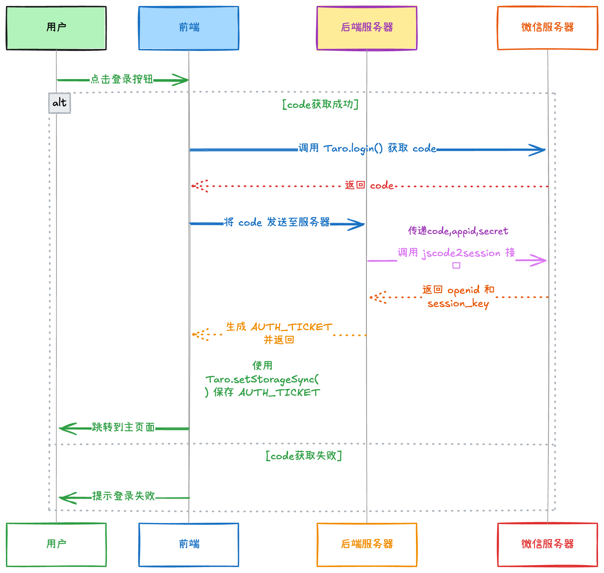

# Deno学习记录 📘

# 📱 Taro 学习总结

Taro 是一个开放式跨端跨框架解决方案，助力开发者快速构建小程序、H5和原生应用


## 📑 目录

- [基础概念](#-基础概念)
- [项目结构](#-项目结构)
- [基础使用](#-基础使用)
- [小程序开发注意事项](#-小程序开发注意事项)
- [常见问题与解决方案](#-常见问题与解决方案)
- [小程序打包与发布](#-小程序打包与发布)
- [性能优化最佳实践](#-性能优化最佳实践)
- [小程序特有功能](#-小程序特有功能)
- [最佳实践](#-最佳实践)

---

## 🔰 基础概念

Taro 是一个开放式跨端跨框架解决方案，支持使用 React/Vue/Nerv 等框架来开发小程序、H5、RN 等应用。

---

## 📂 项目结构

一个典型的 Taro 项目结构：

| 目录/文件 | 说明 |
|:----------|:------|
| 📁 `config/` | 项目编译配置目录 |
| 📁 `src/` | 源码目录 |
| ├─ 📄 `app.config.ts` | 全局配置文件 |
| ├─ 📄 `app.ts` | 入口文件 |
| ├─ 📄 `app.scss` | 全局样式文件 |
| ├─ 📁 `pages/` | 页面文件目录 |
| ├─ 📁 `components/` | 组件目录 |
| ├─ 📁 `assets/` | 静态资源目录 |
| ├─ 📁 `utils/` | 工具函数目录 |
| ├─ 📁 `stores/` | 状态管理目录 |
| └─ 📁 `services/` | 服务接口目录 |

---

## 🚀 基础使用

### 1️⃣ 项目创建和启动

```bash
# 安装 Taro CLI
npm install -g @tarojs/cli

# 创建项目
taro init myApp

# 开发微信小程序
npm run dev:weapp

# 打包微信小程序
npm run build:weapp
```

### 2️⃣ 配置文件

`app.config.ts` 用于项目全局配置：

```typescript
export default {
  // 页面路径列表
  pages: [
    'pages/home/index',
    'pages/mine/index'
  ],
  // 全局窗口配置
  window: {
    backgroundTextStyle: 'light',
    navigationBarBackgroundColor: '#fff',
    navigationBarTitleText: 'WeChat',
    navigationBarTextStyle: 'black'
  },
  // 底部 TabBar 配置
  tabBar: {
    color: '#999',
    selectedColor: '#dc2743',
    backgroundColor: '#fff',
    list: [
      {
        pagePath: 'pages/home/index',
        text: '首页',
        iconPath: './assets/images/home.png',
        selectedIconPath: './assets/images/home-active.png'
      },
      {
        pagePath: 'pages/mine/index',
        text: '我的',
        iconPath: './assets/images/mine.png',
        selectedIconPath: './assets/images/mine-active.png'
      }
    ]
  }
}
```

### 3️⃣ 应用入口

`app.ts` 是应用入口文件：

```typescript
import { createApp } from 'vue'
import { createPinia } from 'pinia'
import './app.scss'

// 创建应用实例
const App = createApp({
  onLaunch() {
    // 应用启动时触发
    console.log('App launched')
  },
  onShow(options) {
    // 应用显示时触发
    console.log('App shown', options)
  }
})

// 使用状态管理
const pinia = createPinia()
App.use(pinia)

export default App
```

### 4️⃣ 页面开发

每个页面通常包含三个文件：
- `index.vue` - 页面组件
- `index.scss` - 页面样式
- `index.config.ts` - 页面配置

**页面组件示例（Vue3）：**

```vue
<template>
  <view class="page">
    <text>{{ message }}</text>
    <button @tap="handleClick">点击我</button>
  </view>
</template>

<script setup lang="ts">
import { ref } from 'vue'
import Taro from '@tarojs/taro'

const message = ref('Hello World')

const handleClick = () => {
  Taro.showToast({
    title: '点击成功',
    icon: 'success'
  })
}
</script>

<style lang="scss">
.page {
  padding: 20px;
}
</style>
```

**页面配置示例：**

```typescript
export default {
  navigationBarTitleText: '页面标题'
}
```

---

## ⚠️ 小程序开发注意事项

### 📌 生命周期

#### Taro 框架生命周期：

| 生命周期 | 说明 |
|:---------|:------|
| 🔄 `onLaunch` | 应用初始化 |
| 👁️ `onShow` | 应用显示 |
| 🙈 `onHide` | 应用隐藏 |
| ❌ `onError` | 应用发生错误 |

#### 页面生命周期：

| 生命周期 | 说明 |
|:---------|:------|
| 📥 `onLoad` | 页面加载 |
| ✅ `onReady` | 页面初次渲染完成 |
| 👁️ `onShow` | 页面显示 |
| 🙈 `onHide` | 页面隐藏 |
| 📤 `onUnload` | 页面卸载 |
| ⬇️ `onPullDownRefresh` | 下拉刷新 |
| ⬆️ `onReachBottom` | 上拉触底 |
| 📜 `onPageScroll` | 页面滚动 |
| 📤 `onShareAppMessage` | 用户点击右上角分享 |

#### 组合式 API 中使用生命周期：

```typescript
import { onMounted, onUnmounted } from 'vue'
import { useDidShow, useDidHide } from '@tarojs/taro'

// Vue 生命周期
onMounted(() => {
  console.log('组件挂载')
})

onUnmounted(() => {
  console.log('组件卸载')
})

// Taro 页面生命周期
useDidShow(() => {
  console.log('页面显示')
})

useDidHide(() => {
  console.log('页面隐藏')
})
```

### 📌 路由与导航

Taro 导航 API：

| API | 说明 |
|:-----|:-----|
| 🔀 `Taro.navigateTo` | 保留当前页面，跳转到应用内的某个页面 |
| 🔄 `Taro.redirectTo` | 关闭当前页面，跳转到应用内的某个页面 |
| 📑 `Taro.switchTab` | 跳转到 tabBar 页面，并关闭其他所有非 tabBar 页面 |
| ◀️ `Taro.navigateBack` | 关闭当前页面，返回上一页面或多级页面 |
| 🔃 `Taro.reLaunch` | 关闭所有页面，打开到应用内的某个页面 |

```typescript
// 示例用法
Taro.navigateTo({
  url: '/pages/detail/index?id=123'
})
```

### 📌 状态管理

**Pinia (Vue3)：**

```typescript
// 创建 store
import { defineStore } from 'pinia'

export const useCounterStore = defineStore('counter', {
  state: () => ({
    count: 0
  }),
  actions: {
    increment() {
      this.count++
    }
  }
})

// 使用 store
import { useCounterStore } from '../stores/counter'

const counterStore = useCounterStore()
counterStore.increment()
```

### 📌 数据存储

小程序数据存储 API：

| API | 说明 |
|:-----|:-----|
| 💾 `Taro.setStorage` | 异步存储数据 |
| 💾 `Taro.setStorageSync` | 同步存储数据 |
| 📂 `Taro.getStorage` | 异步获取数据 |
| 📂 `Taro.getStorageSync` | 同步获取数据 |
| 🗑️ `Taro.removeStorage` | 异步移除数据 |
| 🗑️ `Taro.removeStorageSync` | 同步移除数据 |
| 🧹 `Taro.clearStorage` | 清除所有数据 |

```typescript
// 示例用法
Taro.setStorageSync('token', 'abc123')
const token = Taro.getStorageSync('token')
```

### 📌 网络请求

```typescript
// 基本用法
Taro.request({
  url: 'https://api.example.com/data',
  method: 'GET',
  data: { id: 123 },
  header: {
    'content-type': 'application/json',
    'Authorization': 'Bearer token'
  },
  success: (res) => {
    console.log('请求成功：', res.data)
  },
  fail: (err) => {
    console.error('请求失败：', err)
  }
})

// Promise 用法
try {
  const res = await Taro.request({
    url: 'https://api.example.com/data'
  })
  console.log('请求成功：', res.data)
} catch (err) {
  console.error('请求失败：', err)
}
```

### 📌 UI 组件使用

Taro 内置基础组件：

```vue
<template>
  <view class="container">
    <!-- 文本 -->
    <text>文本内容</text>
    
    <!-- 按钮 -->
    <button type="primary" @tap="handleClick">按钮</button>
    
    <!-- 图片 -->
    <image src="/assets/logo.png" mode="aspectFit" />
    
    <!-- 滚动视图 -->
    <scroll-view scroll-y style="height: 300px">
      <view v-for="item in list" :key="item.id">{{ item.name }}</view>
    </scroll-view>
    
    <!-- 表单组件 -->
    <input type="text" v-model="inputValue" placeholder="请输入" />
  </view>
</template>
```

### 📌 小程序分享功能

```typescript
// 页面内设置分享
Taro.useShareAppMessage(() => {
  return {
    title: '分享标题',
    path: '/pages/home/index?share=true',
    imageUrl: '/assets/share.png'
  }
})

// 分享到朋友圈
Taro.useShareTimeline(() => {
  return {
    title: '分享到朋友圈的标题',
    query: 'share=true',
    imageUrl: '/assets/share.png'
  }
})
```

---

## 🚫 易错点与开发陷阱

### ⛔ 生命周期使用错误

> ❌ **不要在 `onLoad` 中使用 `useState` 等 hooks**  
> 应在函数组件顶层使用

> ❌ **不要在 `onLoad` 中直接修改 data**  
> 可能导致视图不更新

> ❌ **不要在小程序 App 的 `onLaunch` 里调用页面跳转相关的 API**

### ⛔ JSX/模板语法差异

条件渲染：小程序不支持 `&&` 短路运算符条件渲染，应使用三元运算符

```jsx
/* ❌ 错误 */
{ isShow && <View>内容</View> }
  
/* ✅ 正确 */
{ isShow ? <View>内容</View> : null }
```

### ⛔ 事件处理

> ✅ **事件名称使用小驼峰**（onTap），而非原生小程序的连字符写法（bind:tap）  
> ✅ **阻止事件冒泡需使用 `stopPropagation`**，而非 `return false`

### ⛔ 样式问题

> ❌ **选择器错误**：小程序不支持所有 CSS 选择器（如一些伪类选择器）  
> ⚠️ **样式隔离**：页面样式会影响到组件，需注意作用域  
> ⚠️ **rpx 计算**：设计稿尺寸非 750px 时，需要做等比例换算

### ⛔ API 使用误区

> ⚠️ `Taro.navigateTo` 最多只能打开 10 层页面  
> ⚠️ `Taro.setStorage` 存储的数据不能超过 10MB  
> ⚠️ 微信小程序单个页面的逻辑层初始化耗时不能超过 20s

---

## 🛠️ 常见问题与解决方案

### 🎨 样式问题

- Taro 中使用 `px` 单位会自动转换为小程序的 `rpx`
- 如需使用原生单位，可使用 `Px` 或 `PX`
- 推荐使用 SCSS/SASS 预处理器

### 🔄 平台差异处理

```typescript
import Taro from '@tarojs/taro'

// 获取当前环境
const env = Taro.getEnv()

// 判断平台
if (env === Taro.ENV_TYPE.WEAPP) {
  // 微信小程序环境
  console.log('当前是微信小程序环境')
} else if (env === Taro.ENV_TYPE.ALIPAY) {
  // 支付宝小程序环境
  console.log('当前是支付宝小程序环境')
} else if (env === Taro.ENV_TYPE.H5) {
  // H5环境
  console.log('当前是H5环境')
}
```

### ⚡ 性能优化

- 避免频繁的数据更新导致不必要的渲染
- 列表组件使用唯一且稳定的 key
- 合理使用缓存机制
- 按需加载资源

### ⏳ 异步 API 的处理

```typescript
// Promise 化
try {
  const res = await Taro.showModal({
    title: '提示',
    content: '确认删除？'
  })
  if (res.confirm) {
    // 用户点击确定
    await deleteItem()
    Taro.showToast({ title: '删除成功' })
  }
} catch (error) {
  console.error('操作失败', error)
}
```

---

## 📦 小程序打包与发布

### 📱 分包配置

> 小程序有体积限制，主包最大 2MB，单个分包最大 2MB，总体积不超过 20MB

```typescript
// app.config.ts
export default {
  pages: [
    'pages/index/index', // 主包页面
  ],
  subPackages: [
    {
      root: 'packageA', // 分包根目录
      pages: [
        'pages/detail/index', // 实际路径: packageA/pages/detail/index
      ]
    },
    {
      root: 'packageB',
      name: 'pack2', // 分包别名，可选
      pages: [
        'pages/list/index',
      ]
    }
  ]
}
```

### 📊 分包优化策略

| 策略 | 说明 |
|:------|:------|
| 📋 **按功能拆分** | 将功能相近的页面放入同一分包 |
| 🔄 **按访问频率拆分** | 高频页面放主包，低频页面放分包 |
| 🔗 **公共资源处理** | 配置预加载规则提高体验 |

```typescript
// app.config.ts
export default {
  // ...
  preloadRule: {
    'pages/index/index': { // 页面路径
      network: 'all', // 在指定网络下预下载，all表示不限网络
      packages: ['packageA'] // 进入页面后预下载分包
    }
  }
}
```

### 🏞️ 独立分包

```typescript
// app.config.ts
export default {
  // ...
  subPackages: [
    {
      root: 'independentPackage',
      pages: [
        'pages/independent/index'
      ],
      independent: true // 设置为独立分包
    }
  ]
}
```

**独立分包特点：**
- ✅ 不依赖主包即可运行
- ✅ 适合广告页、活动页等临时页面
- ✅ 可减少启动时加载时间

### 🔄 分包预加载

```typescript
// app.config.ts
export default {
  // ...
  preloadRule: {
    'pages/index/index': {
      network: 'all',
      packages: ['packageA']
    },
    'packageA/pages/detail/index': {
      network: 'wifi', // 仅在WiFi环境下预加载
      packages: ['packageB']
    }
  }
}
```

### 📉 包体积优化

#### 🗜️ 代码压缩

```js
// config/index.js
module.exports = {
  mini: {
    // 压缩配置
    optimizeMainPackage: {
      enable: true,
    },
    // 混淆配置
    webpackChain(chain) {
      chain.optimization.minimizer('terser')
        .tap(args => {
          args[0].terserOptions = {
            compress: true,
            keep_classnames: true,
            keep_fnames: true
          }
          return args
        })
    }
  }
}
```

#### 🖼️ 资源优化

| 优化方式 | 说明 |
|:---------|:------|
| 🗜️ 压缩图片 | 使用 WebP 等高压缩比格式 |
| ☁️ CDN 加载 | 大图片放 CDN，通过网络加载 |
| 📝 使用图标字体 | 替代图片图标，减少体积 |
| 🔗 资源合并 | 减少网络请求数量 |

#### 📥 按需引入

```typescript
// ❌ 错误：全量引入
import { Button, Input, Form } from '@tarojs/components'
  
// ✅ 正确：按需引入
import Button from '@tarojs/components/button'
import Input from '@tarojs/components/input'
```

### 🚀 发布流程与审核

#### 📋 版本号管理
遵循语义化版本规范（SemVer）

#### 📝 提审材料准备
- 📋 完整的小程序功能介绍
- 🔑 测试账号（如需登录）
- 📜 相关资质材料
- 📑 隐私协议和用户协议

#### ⚠️ 常见审核问题
- ❌ 诱导分享/评价
- ❌ 不合规内容和功能
- ❌ 个人信息收集不规范
- ❌ UI与体验不符合平台规范

### 🔄 CI/CD 自动化发布

```yaml
# .github/workflows/deploy.yml
name: Deploy Mini Program
on:
  push:
    branches: [ main ]
jobs:
  build:
    runs-on: ubuntu-latest
    steps:
      - uses: actions/checkout@v2
      - name: Use Node.js
        uses: actions/setup-node@v1
        with:
          node-version: '16'
      - run: npm ci
      - run: npm run build:weapp
      - name: Upload to WeChat DevTools
        uses: zhuowenli/taro-build-action@v1
        with:
          project-path: './dist'
          private-key: ${{ secrets.PRIVATE_KEY }}
          private-key-id: ${{ secrets.PRIVATE_KEY_ID }}
          upload-desc: 'Auto deploy from Github Actions'
```

---

## ⚡ 性能优化最佳实践

### 🚀 启动性能优化

| 优化方式 | 说明 |
|:---------|:------|
| 📦 精简主包 | 将非必要页面移至分包 |
| 🔄 预下载分包 | 提前加载可能需要的分包 |
| ⚡ 启用初始渲染缓存 | 提高页面显示速度 |

```typescript
// app.config.ts
export default {
  // ...
  window: {
    initialRenderingCache: 'static' // 开启静态初始渲染缓存
  }
}
```

### ⏱️ 运行时性能优化

#### 🛑 避免不必要的渲染

```typescript
import { throttle } from '../utils/tools'

// 节流处理
const handleScroll = throttle(() => {
  // 处理滚动逻辑
}, 200)
```

#### 📜 长列表优化

```vue
<scroll-view 
  scroll-y 
  style="height: 500px"
  virtual-item-height="50" 
  enableVirtualList>
  <virtual-item v-for="item in list" :key="item.id">
    {{ item.name }}
  </virtual-item>
</scroll-view>
```

#### 🖼️ 图片懒加载

```vue
<image lazy-load src="{{imageUrl}}" />
```

### 💀 骨架屏优化

```typescript
// index.config.ts
export default {
  // ...
  initialRenderingCache: {
    skeleton: { // 配置骨架屏
      mode: 'fullscreen', // 全屏骨架屏
      source: 'native', // 使用原生骨架屏
    }
  }
}
```

### 🌐 网络请求优化

| 优化方式 | 说明 |
|:---------|:------|
| 🔗 合并请求 | 减少请求次数 |
| 📋 请求队列 | 避免同时发起过多请求 |
| ⏱️ 超时与重试 | 合理设置请求超时和重试策略 |
| 🚀 HTTP/2 | 启用 HTTP/2 优化连接 |

```typescript
Taro.request({
  url: 'https://api.example.com/data',
  enableHttp2: true, // 开启HTTP/2
  enableQuic: true, // 开启QUIC
  enableCache: true, // 开启缓存
})
```

---

## 🔐 小程序特有功能

### 🔑 小程序登录流程优化

#### 完整登录流程图



#### 登录流程说明

1. **本地验证阶段**：
   - 检查本地是否有登录凭证(token)
   - 若有token，验证其有效性
   - 若无token或token无效，进入微信登录流程

2. **获取凭证阶段**：
   - 调用`Taro.login()`获取临时登录凭证code
   - 将code发送至应用服务器

3. **服务端身份验证**：
   - 应用服务器携带code、appid和secret请求微信服务器
   - 微信服务器返回openid和session_key
   - 应用服务器根据openid查询用户是否存在

4. **用户处理阶段**：
   - 若用户已存在：更新用户登录时间，生成新token
   - 若用户不存在：创建新用户记录，生成token
   - 将token和用户基本信息返回小程序前端

5. **登录完成阶段**：
   - 小程序保存token到本地存储
   - 保存必要的用户信息
   - 更新应用的登录状态
   - 进入小程序主界面

#### 代码实现

##### 前端实现（Taro）

```typescript
// login.ts
import Taro from '@tarojs/taro'
import { login as apiLogin } from '../services/auth'

// 登录状态检查与登录流程
export async function ensureLogin() {
  // 1. 检查本地是否有有效的 token
  const token = Taro.getStorageSync('token')
  
  if (token) {
    try {
      // 2. 验证 token 是否有效
      const checkResult = await checkTokenValidity(token)
      if (checkResult.valid) {
        console.log('token 有效，已登录')
        return true
      }
    } catch (err) {
      console.log('token 校验失败，需要重新登录')
    }
  }
  
  // 3. token 无效或不存在，进行登录流程
  return await wxLogin()
}

// 微信登录流程
async function wxLogin() {
  try {
    // 显示加载提示
    Taro.showLoading({ title: '登录中...' })
    
    // 4. 调用微信登录，获取 code
    const { code } = await Taro.login()
    if (!code) {
      throw new Error('微信登录失败，获取 code 失败')
    }
    
    // 5. 将 code 发送给后端
    const loginResult = await apiLogin({ code })
    
    // 6. 存储登录状态和用户信息
    Taro.setStorageSync('token', loginResult.token)
    Taro.setStorageSync('userInfo', loginResult.userInfo)
    
    // 判断是否是新用户，如果是新用户可以引导完善资料
    if (loginResult.isNewUser) {
      Taro.navigateTo({ url: '/pages/user-profile/index' })
    }
    
    Taro.hideLoading()
    return true
  } catch (error) {
    console.error('登录失败', error)
    Taro.hideLoading()
    
    Taro.showToast({
      title: '登录失败，请重试',
      icon: 'none'
    })
    
    return false
  }
}

// 校验 token 有效性
async function checkTokenValidity(token) {
  try {
    const res = await Taro.request({
      url: '/api/auth/check-token',
      header: {
        'Authorization': `Bearer ${token}`
      }
    })
    return { valid: res.data.valid }
  } catch (error) {
    return { valid: false }
  }
}
```

##### 服务端实现（Node.js）

```typescript
// auth.controller.ts
import { Request, Response } from 'express'
import axios from 'axios'
import jwt from 'jsonwebtoken'
import { User } from '../models/user.model'

// 微信登录配置
const WX_CONFIG = {
  appId: process.env.WX_APP_ID,
  appSecret: process.env.WX_APP_SECRET,
  loginUrl: 'https://api.weixin.qq.com/sns/jscode2session'
}

// 登录接口
export async function login(req: Request, res: Response) {
  try {
    const { code } = req.body
    
    if (!code) {
      return res.status(400).json({ 
        success: false, 
        message: '缺少登录code' 
      })
    }
    
    // 1. 请求微信API获取openid和session_key
    const wxResponse = await axios.get(WX_CONFIG.loginUrl, {
      params: {
        appid: WX_CONFIG.appId,
        secret: WX_CONFIG.appSecret,
        js_code: code,
        grant_type: 'authorization_code'
      }
    })
    
    const { openid, session_key } = wxResponse.data
    
    if (!openid) {
      return res.status(401).json({ 
        success: false, 
        message: '获取openid失败' 
      })
    }
    
    // 2. 根据openid查询数据库，判断用户是否存在
    let user = await User.findOne({ openid })
    let isNewUser = false
    
    // 3. 如果用户不存在，则创建新用户
    if (!user) {
      isNewUser = true
      user = await User.create({
        openid,
        createdAt: new Date(),
        // 其他默认数据
        nickname: `用户${Math.floor(Math.random() * 10000)}`,
        avatarUrl: '', // 默认头像
      })
    }
    
    // 4. 生成token
    const token = jwt.sign(
      { userId: user._id, openid },
      process.env.JWT_SECRET,
      { expiresIn: '7d' }
    )
    
    // 5. 更新用户的最后登录时间
    await User.updateOne(
      { _id: user._id },
      { $set: { lastLoginAt: new Date() } }
    )
    
    // 6. 返回登录结果
    return res.status(200).json({
      success: true,
      token,
      userInfo: {
        _id: user._id,
        nickname: user.nickname,
        avatarUrl: user.avatarUrl,
        // 其他需要的用户信息
      },
      isNewUser
    })
    
  } catch (error) {
    console.error('登录异常:', error)
    return res.status(500).json({
      success: false,
      message: '服务器错误'
    })
  }
}

// 验证token接口
export async function checkToken(req: Request, res: Response) {
  try {
    // token已经在中间件中验证过，能到这里说明token有效
    return res.status(200).json({
      valid: true
    })
  } catch (error) {
    return res.status(401).json({
      valid: false
    })
  }
}
```

#### 请求封装

```typescript
// request.ts
import Taro from '@tarojs/taro'
import { ensureLogin } from './login'

// 封装请求方法，自动携带token和处理登录态
export async function request(options) {
  // 获取存储的token
  const token = Taro.getStorageSync('token')
  
  // 合并请求头
  const header = {
    'Content-Type': 'application/json',
    ...options.header
  }
  
  // 如果有token，则添加到请求头
  if (token) {
    header['Authorization'] = `Bearer ${token}`
  }
  
  try {
    const response = await Taro.request({
      ...options,
      header
    })
    
    // 请求成功
    if (response.statusCode >= 200 && response.statusCode < 300) {
      return response.data
    }
    
    // token 失效（401）
    if (response.statusCode === 401) {
      // 清除已失效的token
      Taro.removeStorageSync('token')
      
      // 重新登录
      const loginSuccess = await ensureLogin()
      
      if (loginSuccess) {
        // 登录成功，重试原请求
        return request(options)
      } else {
        throw new Error('登录失败，无法完成请求')
      }
    }
    
    // 其他错误
    throw new Error(response.data.message || '请求失败')
    
  } catch (error) {
    console.error('请求异常:', error)
    throw error
  }
}
```

#### 登录状态管理（使用Pinia）

```typescript
// stores/user.ts
import { defineStore } from 'pinia'
import Taro from '@tarojs/taro'
import { ensureLogin } from '../utils/login'
import { getUserInfo } from '../services/user'

export const useUserStore = defineStore('user', {
  state: () => ({
    token: Taro.getStorageSync('token') || '',
    userInfo: Taro.getStorageSync('userInfo') || null,
    isLoggedIn: !!Taro.getStorageSync('token'),
    isLoading: false
  }),
  
  actions: {
    // 初始化检查登录状态
    async checkLoginStatus() {
      this.isLoading = true
      try {
        if (this.isLoggedIn) {
          // 刷新用户信息
          await this.fetchUserInfo()
        }
      } catch (error) {
        // 出错则置为未登录状态
        this.isLoggedIn = false
        this.token = ''
        this.userInfo = null
        Taro.removeStorageSync('token')
        Taro.removeStorageSync('userInfo')
      } finally {
        this.isLoading = false
      }
    },
    
    // 登录
    async login() {
      this.isLoading = true
      try {
        const success = await ensureLogin()
        if (success) {
          this.token = Taro.getStorageSync('token')
          this.userInfo = Taro.getStorageSync('userInfo')
          this.isLoggedIn = true
          return true
        }
        return false
      } catch (error) {
        console.error('登录失败', error)
        return false
      } finally {
        this.isLoading = false
      }
    },
    
    // 获取用户信息
    async fetchUserInfo() {
      if (!this.token) return
      
      try {
        const userInfo = await getUserInfo()
        this.userInfo = userInfo
        Taro.setStorageSync('userInfo', userInfo)
      } catch (error) {
        console.error('获取用户信息失败', error)
      }
    },
    
    // 退出登录
    logout() {
      this.token = ''
      this.userInfo = null
      this.isLoggedIn = false
      Taro.removeStorageSync('token')
      Taro.removeStorageSync('userInfo')
      Taro.showToast({ title: '已退出登录', icon: 'success' })
    }
  }
})
```

#### 登录流程使用示例

```vue
<template>
  <view class="login-page">
    <view v-if="!userStore.isLoggedIn">
      <button @tap="handleLogin" :loading="userStore.isLoading">
        微信一键登录
      </button>
    </view>
    <view v-else>
      <view class="user-info">
        <image :src="userStore.userInfo?.avatarUrl || defaultAvatar" class="avatar" />
        <text class="nickname">{{ userStore.userInfo?.nickname || '未设置昵称' }}</text>
      </view>
      <button @tap="userStore.logout" type="default">退出登录</button>
    </view>
  </view>
</template>

<script setup>
import { onLoad } from '@tarojs/taro'
import { useUserStore } from '../../stores/user'

const userStore = useUserStore()
const defaultAvatar = '../../assets/default-avatar.png'

// 页面加载时检查登录状态
onLoad(() => {
  userStore.checkLoginStatus()
})

// 处理登录
const handleLogin = async () => {
  const success = await userStore.login()
  if (success) {
    console.log('登录成功')
  }
}
</script>
```

#### 登录安全最佳实践

1. **使用 HTTPS**：所有接口通信必须使用 HTTPS 加密传输

2. **TOKEN 处理**：
   - 设置合理的过期时间（通常7天以内）
   - 支持主动刷新 TOKEN
   - 退出登录时清除 TOKEN

3. **敏感信息存储**：
   - 不在客户端存储用户敏感信息
   - 使用小程序提供的安全存储 API

4. **防刷防暴力**：
   - 登录接口增加频率限制
   - 多次失败后要求图形验证码或延时

5. **用户信息保护**：
   - 只返回必要的用户信息
   - 敏感操作需要二次验证

### 👤 获取用户信息

```vue
<template>
  <button 
    open-type="chooseAvatar" 
    @chooseavatar="onChooseAvatar">
    选择头像
  </button>
  
  <input 
    type="nickname" 
    placeholder="请输入昵称" 
    @change="onNicknameChange" 
  />
</template>

<script setup>
import { ref } from 'vue'
import Taro from '@tarojs/taro'

const avatarUrl = ref('')
const nickname = ref('')

const onChooseAvatar = (e) => {
  avatarUrl.value = e.detail.avatarUrl
}

const onNicknameChange = (e) => {
  nickname.value = e.detail.value
}

const saveUserInfo = async () => {
  if (!avatarUrl.value || !nickname.value) {
    Taro.showToast({
      title: '请完善信息',
      icon: 'none'
    })
    return
  }
  
  // 上传头像到服务器
  const uploadRes = await uploadFile(avatarUrl.value)
  
  // 保存用户信息
  await updateUserInfo({
    avatarUrl: uploadRes.url,
    nickname: nickname.value
  })
}
</script>
```

### 📱 小程序适配与兼容性

#### 📊 基础库版本

```typescript
// app.config.ts
export default {
  // ...
  miniprogramRoot: './',
  projectname: 'MyApp',
  setting: {
    minified: true, // 压缩代码
    es6: true, // 开启ES6转换
  },
  libVersion: '2.24.7', // 指定基础库版本
}
```

#### 🔄 版本检测与提示

```typescript
const checkVersion = () => {
  // 获取微信版本信息
  const version = Taro.getSystemInfoSync().SDKVersion
  
  // 比较版本号
  if (Taro.compareVersion(version, '2.21.0') < 0) {
    Taro.showModal({
      title: '提示',
      content: '当前微信版本过低，请更新至最新版本',
      showCancel: false
    })
  }
}
```

### 🎨 WeUI 组件使用

```typescript
// app.config.ts
export default {
  // ...
  useExtendedLib: {
    weui: true
  }
}
```

使用示例：
```vue
<template>
  <weui-form>
    <weui-cells title="表单">
      <weui-cell>
        <weui-input placeholder="请输入" />
      </weui-cell>
    </weui-cells>
    <weui-button type="primary">提交</weui-button>
  </weui-form>
</template>
```

---

## ✨ 最佳实践

| 实践 | 说明 |
|:------|:------|
| 📁 **代码组织** | 按功能模块拆分组件，避免过大的页面文件 |
| 🔄 **状态管理** | 复杂应用使用 Pinia 等状态管理工具 |
| 🎨 **样式管理** | 使用预处理器，模块化CSS |
| 🔄 **兼容性** | 注意小程序平台差异，做好兼容处理 |
| 🔒 **安全性** | 敏感数据不存储在本地，使用token验证请求 |
| ⚠️ **错误处理** | 完善的错误捕获和提示机制 |
| 🔄 **代码复用** | 抽取公共逻辑到 hooks/composables 中 |
| 🔌 **接口封装** | 统一封装网络请求，便于管理 |
