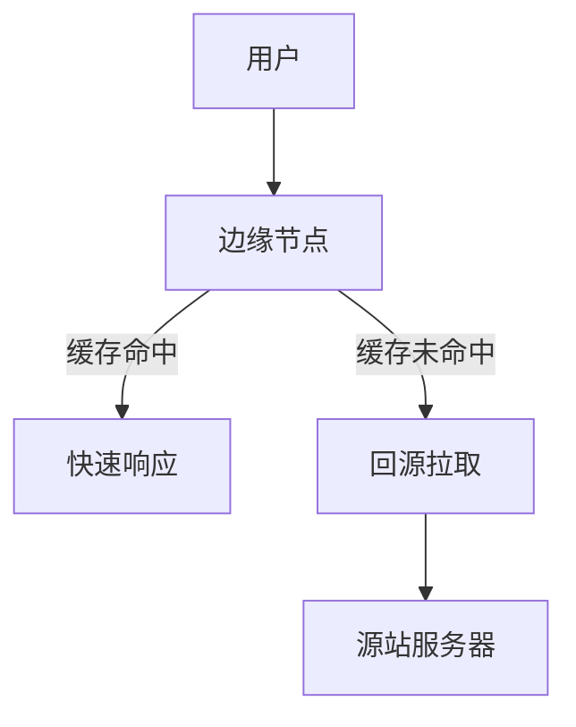

# Web 性能优化完全指南

## 目录
- [1. 加载性能优化](#1-加载性能优化)
- [2. 渲染性能优化](#2-渲染性能优化)
- [3. 资源优化](#3-资源优化)
- [4. 网络层优化](#4-网络层优化)
- [5. 缓存策略](#5-缓存策略)
- [6. 框架级优化](#6-框架级优化)
- [7. 移动端专项优化](#7-移动端专项优化)
- [8. 性能监控与分析](#8-性能监控与分析)
- [9. 进阶优化策略](#9-进阶优化策略)
- [10. 工具链推荐](#10-工具链推荐)

<a id="1-加载性能优化"></a>
## 1. 加载性能优化

### 1.1 关键渲染路径优化
#### 1.1.1 CSS优化
```javascript
// 1. 内联关键CSS
<style>
  /* 首屏关键样式 */
  .header { ... }
  .hero-section { ... }
</style>

// 2. 异步加载非关键CSS
<link rel="preload" href="critical.css" as="style" onload="this.rel='stylesheet'">
<noscript><link rel="stylesheet" href="critical.css"></noscript>

// 3. 媒体查询优化
<link rel="stylesheet" href="print.css" media="print">
<link rel="stylesheet" href="desktop.css" media="(min-width: 1024px)">
```

#### 1.1.2 JavaScript优化
```javascript
// 1. 脚本加载策略
<script src="critical.js"></script>           // 关键脚本
<script src="app.js" defer></script>          // 延迟执行
<script src="analytics.js" async></script>    // 异步加载

// 2. 模块化加载
<script type="module" src="app.mjs"></script>

// 3. 条件加载
if ('IntersectionObserver' in window) {
  import('./lazyload.js').then(module => {
    // 实现懒加载
  });
}
```

### 1.2 资源预加载策略
```html
<!-- 1. DNS预解析 -->
<link rel="dns-prefetch" href="//api.example.com">

<!-- 2. 预连接 -->
<link rel="preconnect" href="https://cdn.example.com">

<!-- 3. 预加载关键资源 -->
<link rel="preload" href="font.woff2" as="font" type="font/woff2" crossorigin>
<link rel="preload" href="hero-image.jpg" as="image">

<!-- 4. 预获取下一页资源 -->
<link rel="prefetch" href="/next-page.js">

<!-- 5. 预渲染下一页 -->
<link rel="prerender" href="/likely-next-page.html">
```

### 1.3 智能代码分割
```javascript
// 1. 路由级别分割
const routes = [
  {
    path: '/dashboard',
    component: () => import(
      /* webpackChunkName: "dashboard" */
      './views/Dashboard.vue'
    )
  }
];

// 2. 组件级别分割
const HeavyComponent = React.lazy(() => import('./HeavyComponent'));

// 3. 条件分割
if (user.isPremium) {
  import('./premium-features').then(module => {
    module.initPremiumFeatures();
  });
}

// 4. 库分割
const loadLuxuryFeatures = () => {
  Promise.all([
    import('chart.js'),
    import('@google/model-viewer')
  ]).then(([Chart, ModelViewer]) => {
    // 初始化高级功能
  });
};
```

<a id="2-渲染性能优化"></a>
## 2. 渲染性能优化

### 2.1 DOM操作优化
```javascript
// 1. 批量DOM操作
const container = document.getElementById('list');
const fragment = document.createDocumentFragment();
const items = new Array(1000).fill(null);

requestAnimationFrame(() => {
  items.forEach(item => {
    const li = document.createElement('li');
    li.textContent = `Item ${item}`;
    fragment.appendChild(li);
  });
  
  container.appendChild(fragment);
});

// 2. 虚拟列表实现
class VirtualList {
  constructor(container, items, rowHeight) {
    this.container = container;
    this.items = items;
    this.rowHeight = rowHeight;
    this.visibleItems = Math.ceil(container.clientHeight / rowHeight);
    this.scrollTop = 0;
    this.startIndex = 0;
    
    this.init();
  }
  
  init() {
    this.container.addEventListener('scroll', this.onScroll.bind(this));
    this.render();
  }
  
  onScroll() {
    this.scrollTop = this.container.scrollTop;
    this.startIndex = Math.floor(this.scrollTop / this.rowHeight);
    this.render();
  }
  
  render() {
    const visibleItems = this.items.slice(
      this.startIndex,
      this.startIndex + this.visibleItems
    );
    
    // 渲染可视区域内容
  }
}
```

### 2.2 CSS性能优化
```css
/* 1. 选择器优化 */
/* 避免 */
div.header ul li a { ... }
#nav .list .item { ... }

/* 推荐 */
.nav-link { ... }
.list-item { ... }

/* 2. 硬件加速 */
.hardware-accelerated {
  transform: translateZ(0);
  will-change: transform;
  backface-visibility: hidden;
}

/* 3. 动画性能优化 */
@keyframes optimized-animation {
  from {
    transform: translateX(0);
    opacity: 0;
  }
  to {
    transform: translateX(100px);
    opacity: 1;
  }
}

.smooth-animation {
  animation: optimized-animation 300ms ease-out;
}

/* 4. 关键CSS属性 */
.performance-critical {
  contain: content;  /* 隔离DOM子树 */
  content-visibility: auto;  /* 智能渲染 */
  contain-intrinsic-size: 0 500px;  /* 预估大小 */
}
```

### 2.3 渲染优化策略
```javascript
// 1. 避免强制同步布局
const cards = document.querySelectorAll('.card');
const heights = [];

// 不好的做法
cards.forEach(card => {
  const height = card.offsetHeight;  // 强制重排
  card.style.height = `${height * 1.5}px`;
});

// 优化后的做法
requestAnimationFrame(() => {
  // 读取
  cards.forEach(card => {
    heights.push(card.offsetHeight);
  });
  
  // 写入
  cards.forEach((card, i) => {
    card.style.height = `${heights[i] * 1.5}px`;
  });
});

// 2. 使用IntersectionObserver优化滚动
const observer = new IntersectionObserver((entries) => {
  entries.forEach(entry => {
    if (entry.isIntersecting) {
      entry.target.classList.add('visible');
      observer.unobserve(entry.target);
    }
  });
}, {
  threshold: 0.1,
  rootMargin: '50px'
});

document.querySelectorAll('.lazy-load').forEach(el => observer.observe(el));
```

<a id="3-资源优化"></a>
## 3. 资源优化

### 3.1 图片优化策略
| 格式       | 适用场景                 | 优化工具          |
|------------|--------------------------|-------------------|
| WebP       | 全平台支持场景           | cwebp             |
| AVIF       | 现代浏览器               | avifenc           |
| 渐进式JPEG | 大图加载体验优化         | jpegtran          |

### 3.2 字体优化
```css
@font-face {
  font-family: 'CustomFont';
  src: url('font.woff2') format('woff2'),
       url('font.woff') format('woff');
  font-display: swap;
  unicode-range: U+000-5FF;
}
```

<a id="4-网络层优化"></a>
## 4. 网络层优化

### 4.1 HTTP/2优化
```nginx
# Nginx配置
server {
  listen 443 ssl http2;
  ssl_certificate /path/to/cert.pem;
  ssl_certificate_key /path/to/key.pem;
  
  # 启用服务器推送
  http2_push /style.css;
  http2_push /app.js;
}
```

### 4.2 CDN策略


<a id="5-缓存策略"></a>
## 5. 缓存策略

### 5.1 缓存头设置
```http
Cache-Control: public, max-age=31536000, immutable
ETag: "xyzzy"
Vary: Accept-Encoding
```

### 5.2 Service Worker缓存
```javascript
const CACHE_NAME = 'v1';
const ASSETS = ['/','/app.js','/style.css'];

self.addEventListener('install', e => {
  e.waitUntil(
    caches.open(CACHE_NAME)
      .then(cache => cache.addAll(ASSETS))
  );
});
```

<a id="6-框架级优化"></a>
## 6. 框架级优化

### 6.1 React优化
```jsx
// 使用memo优化组件
const MemoComponent = React.memo(({ data }) => (
  <div>{data}</div>
));

// 虚拟列表实现
import { FixedSizeList } from 'react-window';
```

### 6.2 Vue优化
```javascript
// 组件懒加载
const routes = [
  { path: '/', component: () => import('./Home.vue') }
];

// 冻结大数据
this.largeData = Object.freeze(bigData);
```

<a id="7-移动端专项优化"></a>
## 7. 移动端专项优化

### 7.1 首屏加速
```html
<!-- 骨架屏 -->
<div class="skeleton">
  <div class="skeleton-header"></div>
  <div class="skeleton-content"></div>
</div>
```

### 7.2 手势优化
```javascript
// 防抖处理
let tapTimer;
element.addEventListener('touchstart', () => {
  tapTimer = setTimeout(() => {
    // 处理点击
  }, 300);
});

element.addEventListener('touchend', () => {
  clearTimeout(tapTimer);
});
```

<a id="8-性能监控与分析"></a>
## 8. 性能监控与分析

### 8.1 核心性能指标详解
| 指标 | 全称 | 中文解释 | 优化建议 | 达标标准 | 测量方式 |
|------|------|----------|----------|----------|----------|
| **FCP** | First Contentful Paint | 首次内容渲染时间 | 1. 优化服务器响应时间<br>2. 移除阻塞渲染的资源<br>3. 压缩CSS/JS文件 | <1.8s | `performance.getEntriesByName('first-contentful-paint')[0]` |
| **LCP** | Largest Contentful Paint | 最大内容渲染时间 | 1. 优化图片加载<br>2. 预加载关键资源<br>3. 使用CDN | <2.5s | PerformanceObserver API |
| **CLS** | Cumulative Layout Shift | 累计布局偏移 | 1. 设置图片尺寸<br>2. 预留广告位置<br>3. 使用transform动画 | <0.1 | Layout Instability API |
| **TTI** | Time to Interactive | 可交互时间 | 1. 减少JavaScript执行时间<br>2. 延迟加载非关键资源<br>3. 代码分割 | <3.9s | web-vitals库 |
| **FID** | First Input Delay | 首次输入延迟 | 1. 减少主线程阻塞<br>2. 使用Web Workers<br>3. 代码分割 | <100ms | PerformanceObserver API |
| **TBT** | Total Blocking Time | 总阻塞时间 | 1. 优化长任务<br>2. 使用requestIdleCallback<br>3. 代码优化 | <300ms | Performance API |
| **FMP** | First Meaningful Paint | 首次有效绘制 | 1. 服务端渲染<br>2. 预渲染<br>3. 骨架屏 | <2.0s | Chrome DevTools |

### 8.2 全面性能监控实现
```javascript
// 1. 性能指标监控
class PerformanceMonitor {
  constructor() {
    this.metrics = {};
    this.init();
  }

  init() {
    // FCP和LCP监控
    new PerformanceObserver((entryList) => {
      for (const entry of entryList.getEntries()) {
        this.metrics[entry.name] = entry.startTime;
        this.sendToAnalytics({
          metric: entry.name,
          value: entry.startTime
        });
      }
    }).observe({ entryTypes: ['paint', 'largest-contentful-paint'] });

    // CLS监控
    let clsValue = 0;
    new PerformanceObserver((entryList) => {
      for (const entry of entryList.getEntries()) {
        if (!entry.hadRecentInput) {
          clsValue += entry.value;
          this.metrics.CLS = clsValue;
        }
      }
    }).observe({ entryTypes: ['layout-shift'] });

    // 长任务监控
    new PerformanceObserver((entryList) => {
      for (const entry of entryList.getEntries()) {
        this.metrics.longTasks = (this.metrics.longTasks || 0) + 1;
      }
    }).observe({ entryTypes: ['longtask'] });
  }

  // 自定义性能标记
  mark(name) {
    performance.mark(name);
  }

  // 测量两个标记之间的时间
  measure(name, startMark, endMark) {
    performance.measure(name, startMark, endMark);
    const duration = performance.getEntriesByName(name)[0].duration;
    this.sendToAnalytics({
      metric: name,
      value: duration
    });
  }

  // 发送数据到分析服务
  sendToAnalytics(data) {
    // 实现数据上报逻辑
    navigator.sendBeacon('/analytics', JSON.stringify(data));
  }
}

// 2. 错误监控
window.addEventListener('error', (event) => {
  // 错误上报
  console.error('JavaScript Error:', event.error);
});

window.addEventListener('unhandledrejection', (event) => {
  // Promise错误上报
  console.error('Unhandled Promise Rejection:', event.reason);
});

// 3. 资源加载监控
const resourceObserver = new PerformanceObserver((list) => {
  for (const entry of list.getEntries()) {
    if (entry.initiatorType === 'img' || entry.initiatorType === 'script') {
      console.log(`Resource ${entry.name} took ${entry.duration}ms to load`);
    }
  }
});

resourceObserver.observe({ entryTypes: ['resource'] });

// 4. 网络状态监控
navigator.connection.addEventListener('change', () => {
  const connection = navigator.connection;
  console.log(`Network type changed: ${connection.effectiveType}`);
});
```

<a id="9-进阶优化策略"></a>
## 9. 进阶优化策略

### 9.1 预渲染
```javascript
// Next.js静态生成
export async function getStaticProps() {
  const data = await fetchData();
  return { props: { data } };
}
```

### 9.2 边缘计算
```javascript
// Cloudflare Workers示例
addEventListener('fetch', event => {
  event.respondWith(handleRequest(event.request));
});

async function handleRequest(request) {
  // 边缘节点处理逻辑
}
```

<a id="10-工具链推荐"></a>
## 10. 工具链推荐

### 10.1 性能分析工具
- **Lighthouse**: 全面性能审计
- **WebPageTest**: 多地点测试
- **Chrome DevTools**: 性能面板

### 10.2 构建优化工具
```bash
# 使用Vite进行构建
npm create vite@latest

# 使用Brotli压缩
npm install compression-webpack-plugin --save-dev
```

## 最佳实践原则
1. **性能预算制定**
   - 设置具体的性能指标目标
   - 建立CI/CD中的性能检查点
   - 定期进行性能审计

2. **监控与报警**
   - 实时监控关键性能指标
   - 设置合理的报警阈值
   - 建立性能劣化预警机制

3. **优化策略分层**
   - 网络层：CDN、HTTP/2、压缩
   - 资源层：代码分割、图片优化
   - 渲染层：CSS优化、DOM操作优化
   - 运行时：JavaScript执行优化

4. **持续优化流程**
   - 性能数据收集
   - 问题分析定位
   - 优化方案实施
   - 效果评估复盘

## 注意事项
⚠️ 性能优化需要数据支撑，避免主观臆断  
⚠️ 优化措施要考虑投入产出比  
⚠️ 保持代码可维护性，避免过度优化  
⚠️ 优先解决对用户体验影响最大的问题  
⚠️ 定期回顾和更新优化策略
